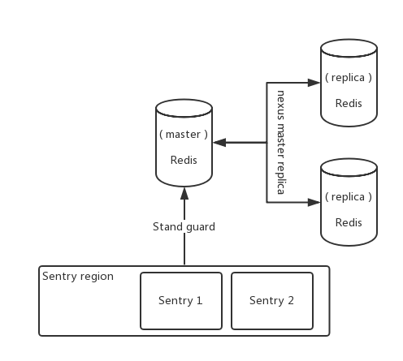

> ### Redis Sentry



> 关闭两端 Linux 的防火墙

```
service iptables stop
```

> 关闭两端 redis.conf 的受保护机制

```
protected-mode no
```

> 在`从` Redis 中配置

```xml
replicaof <masterip> <masterport>
- <masterip> 主 Redis IP
- <masterport> 端口
```

> 拷贝解压目录下的配置文件: `sentinel.conf`

```
[root@admin redis-5.0.3]$ cp sentinel.conf /usr/local/redis/
```

> 更改配置文件中的

```xm&#39;l
sentinel monitor <master-name> <ip> <redis-port> <quorum>
- <master-name> 	可以自定义
- <ip> 				哨兵检测的 IP , 但那 Redis 挂掉了给他从新选择 主
- <redis-port> 		检测的端口号
- <quorum> 			选择新主需要几个哨兵投票

sentinel monitor mymaster 192.168.238.130 6379 1
```

> 1. 将主从启动起来后验证能跑
> 2. 开启哨兵给主服务站岗
> 3. 将主服务`shutdown`掉
> 4. 默认等: 30 秒哨兵会投票选择新的主 Redis

---

> SpringBoot 连接Redis配置哨兵


> 导入 starter

```xml
<dependency>
    <groupId>org.springframework.boot</groupId>
    <artifactId>spring-boot-starter-data-redis</artifactId>
</dependency>
```

> 配置Redis 与 哨兵

```properties
# Redis服务器地址
spring.redis.host=192.168.238.130
spring.redis.port=6379

# 哨兵
spring.redis.sentinel.master=mymaster#哨兵名字
spring.redis.sentinel.nodes=192.168.238.130:26379#哨兵地址:端口
```

> 注入`Template`

```java
@Autowired
private RedisTemplate<String, String> redisTemplate;

@Autowired
private StringRedisTemplate redisTemplate;
```