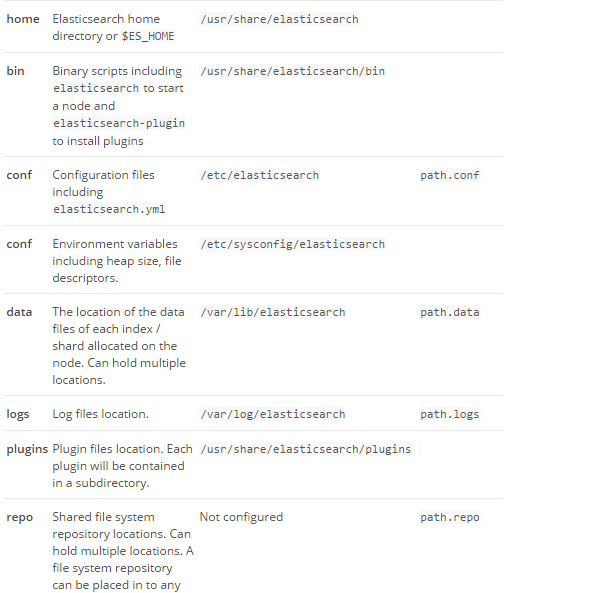
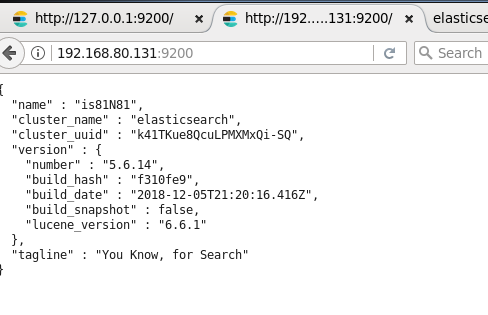

# ElasticSearch

## 简介

### 搜索引擎

　　搜索引擎（Search Engine）是指根据一定的策略、运用特定的计算机程序从互联网上搜集信息，在对信息进行组织和处理后，为用户提供检索服务，将用户检索相关的信息展示给用户的系统。搜索引擎包括全文索引、目录索引、元搜索引擎、垂直搜索（站内搜索）引擎、集合式搜索引擎、门户搜索引擎与免费链接列表等。

### 为什么需要搜索引擎？

　　传统的数据库对结构化数据处理的能力非常好，甚至在数据量很大时也能够通过建索引，集群，分库分表等手段来保持较好的数据处理能力，但碰到需要像like "%abc%"等索引失效的情况，或者对半结构化数据和非结构化数据的处理（如找到一篇标题和内容都有苍老师的博客，并且标题含有苍老师的博客排在前面的问题），数据库就无法提供高效的数据处理了。搜索引擎就为解决此类问题而诞生。

### ElasticSearch

　　Elasticsearch是一个基于[Apache Lucene(TM)](https://lucene.apache.org/core/)的开源搜索引擎。无论在开源还是专有领域，Lucene可以被认为是迄今为止最先进、性能最好的、功能最全的搜索引擎库。但是，Lucene只是一个库。想要使用它，你必须使用Java来作为开发语言并将其直接集成到你的应用中，更糟糕的是，Lucene非常复杂，你需要深入了解检索的相关知识来理解它是如何工作的。Elasticsearch也使用Java开发并使用Lucene作为其核心来实现所有索引和搜索的功能，但是它的目的是通过简单的`RESTful API`来隐藏Lucene的复杂性，从而让全文搜索变得简单。不过，Elasticsearch不仅仅是Lucene和全文搜索，我们还能这样去描述它：

- 分布式的近实时文件存储，每个字段都被索引并可被搜索
- 分布式的实时分析搜索引擎
- 可以扩展到上百台服务器，处理PB级结构化或非结构化数据

而且，所有的这些功能被集成到一个服务里面，你的应用可以通过简单的`RESTful API`、各种语言的客户端甚至命令行与之交互。

### Elasticsearch的功能

（1）分布式的搜索引擎和数据分析引擎

搜索：百度，网站的站内搜索，IT系统的检索
数据分析：电商网站，最近7天牙膏这种商品销量排名前10的商家有哪些；新闻网站，最近1个月访问量排名前3的新闻版块是哪些
分布式，搜索，数据分析

（2）全文检索，结构化检索，数据分析

全文检索：我想搜索商品名称包含牙膏的商品，select * from products where product_name like "%牙膏%"
结构化检索：我想搜索商品分类为日化用品的商品都有哪些，select * from products where category_id='日化用品'
部分匹配、自动完成、搜索纠错、搜索推荐
数据分析：我们分析每一个商品分类下有多少个商品，select category_id,count(*) from products group by category_id

（3）对海量数据进行近实时的处理

分布式：ES自动可以将海量数据分散到多台服务器上去存储和检索
海联数据的处理：分布式以后，就可以采用大量的服务器去存储和检索数据，自然而然就可以实现海量数据的处理了
近实时：检索个数据要花费1小时（这就不要近实时，离线批处理，batch-processing）；在秒级别对数据进行搜索和分析

跟分布式/海量数据相反的：lucene，单机应用，只能在单台服务器上使用，最多只能处理单台服务器可以处理的数据量

### Elasticsearch的特点

（1）可以作为一个大型分布式集群（数百台服务器）技术，处理PB级数据，服务大公司；也可以运行在单机上，服务小公司
（2）Elasticsearch不是什么新技术，主要是将全文检索、数据分析以及分布式技术，合并在了一起，才形成了独一无二的ES；lucene（全文检索），商用的数据分析软件（也是有的），分布式数据库（mycat）
（3）对用户而言，是开箱即用的，非常简单，作为中小型的应用，直接3分钟部署一下ES，就可以作为生产环境的系统来使用了，数据量不大，操作不是太复杂
（4）数据库的功能面对很多领域是不够用的（事务，还有各种联机事务型的操作）；特殊的功能，比如全文检索，同义词处理，相关度排名，复杂数据分析，海量数据的近实时处理；Elasticsearch作为传统数据库的一个补充，提供了数据库所不不能提供的很多功能

### 背景故事

多年前，一个叫做Shay Banon的刚结婚不久的失业开发者，由于妻子要去伦敦学习厨师，他便跟着也去了。在他找工作的过程中，为了给妻子构建一个食谱的搜索引擎，他开始构建一个早期版本的Lucene。

直接基于Lucene工作会比较困难，所以Shay开始抽象Lucene代码以便Java程序员可以在应用中添加搜索功能。他发布了他的第一个开源项目，叫做“Compass”。

后来Shay找到一份工作，这份工作处在高性能和内存数据网格的分布式环境中，因此高性能的、实时的、分布式的搜索引擎也是理所当然需要的。然后他决定重写Compass库使其成为一个独立的服务叫做Elasticsearch。

第一个公开版本出现在2010年2月，在那之后Elasticsearch已经成为Github上最受欢迎的项目之一，代码贡献者超过300人。一家主营Elasticsearch的公司就此成立，他们一边提供商业支持一边开发新功能，不过Elasticsearch将永远开源且对所有人可用。

　　主流搜索引擎：elasticsearch、lucene 、solr 。

### 关键词

**倒排索引（倒排文档）**

　　这种索引表中的每一项都包括一个属性值和具有该属性值的各记录的地址。由于不是由记录来确定属性值，而是由属性值来确定记录的位置，因而称为倒排索引

数据1为：ZhangSan lives in YongZhou,I live in YongZhou too.

数据2为：He once lived in ShenZhen.

数据1，2经过倒排后变成

关键词ID           关键词     			数据ID

​    1		            YongZhou                    1

​    2                      He                                 2   

​    3                      I                                     1

​    4                      live                                1,2

​    5                      zhangsan                     1

​    6                      in                                   1,2  

原理：是先定义一个词库，然后在文章中查找每个词条(term)出现的频率和位置，把这样的频率和位置信息按照词库的顺序归纳，这样就相当于对文件建立了一个以词库为目录的索引，这样查找某个词的时候就能很快的定位到该词出现的位置。

问题：在处理英文文档的时候显然这样的方式是非常好的，因为英文自然的被空格分成若干词，只要我们有足够大的词汇库就能很好的处理。但是亚洲文字因为没有空格作为断词标志，所以就很难判断一个词，而且人们使用的词汇在不断的变化，而维护一个可扩展的词汇库的成本是很高的，所以问题出现了。

解决：出现这样的问题使“分词”成为全文索引的关键技术。目前有两种基本的方法：

　　　　二元法 它把所有有可能的每两两汉字的组合看为一个词组，这样就没有维护词库的开销。

　　　　词库法 它使使用词库中的词作为切分的标准，这样也出现了词库跟不上词汇发展的问题，除非你维护词库。

　　　　实际上现在很多著名的[搜索引擎](https://baike.baidu.com/item/%E6%90%9C%E7%B4%A2%E5%BC%95%E6%93%8E)都使用了多种分词的办法，比如“正向最大匹配”+“逆向最大匹配”，基于统计学的新词识别，自动维护词库等技术，但是显然这样的技术还没有做到完美。

**Near Realtime（NRT）**

　　近实时，两个意思，从写入数据到数据可以被搜索到有一个小延迟（大概1秒）；基于es执行搜索和分析可以达到秒级

**ES**

　　ElasticSearch简称，后面都以ES进行说明。

**cluster**

　　代表一个集群，集群中有多个节点，其中有一个为主节点，这个主节点是可以通过选举产生的，主从节点是对于集群内部来说的。es的一个概念就是去中心化，字面上理解就是无中心节点，这是对于集群外部来说的，因为从外部来看es集群，在逻辑上是个整体，你与任何一个节点的通信和与整个es集群通信是等价的。

**shards**

　　代表索引分片，一个分片是一个 Lucene 的实例。es可以把一个完整的索引分成多个分片，这样的好处是可以把一个大的索引拆分成多个，分布到不同的节点上。构成分布式搜索。分片的数量只能在索引创建前指定，并且索引创建后不能更改。

　　Elasticsearch本身就是分布式的，因此即便你只有一个节点，Elasticsearch默认也会对你的数据进行分片和副本操作，当你向集群添加新数据时，数据也会在新加入的节点中进行平衡。

**replicas**

　　代表索引副本，es可以设置多个索引的副本，副本的作用一是提高系统的容错性，当某个节点某个分片损坏或丢失时可以从副本中恢复。二是提高es的查询效率，es会自动对搜索请求进行负载均衡。

**index**

​	索引类似于库。

​	索引是具有某些相似特征的文档的集合，它和数据库中的索引概念并不十分相同。我们可以把索引理解为数据库文档中的数据库。事实上，我们的数据被存储和索引在分片(shards)中，索引只是一个把一个或多个分片分组在一起的逻辑空间。然而，这只是一些内部细节——我们的程序完全不用关心分片。

**document**

​	文档类似于表里行。

​	文档（document）是ElasticSearch中的主要实体。对所有使用ElasticSearch的案例来说，他们最终都可以归结为对文档的搜索。文档由字段构成。

**mapping**

​	映射类似于表的名字还可以建立规则。

​	所有文档写进索引之前都会先进行分析，如何将输入的文本分割为词条、哪些词条又会被过滤，这种行为叫做映射（mapping）。一般由用户自己定义规则。

**type**

​	类型类似于表。

​	在索引中，我们可以定义一个或多个类型。类型是索引的逻辑类别/分区，其语义完全由开发者决定。通常，为具有一组公共字段的文档定义类型。例如，假设开发者运行博客平台并将所有数据存储在一个索引中。在此索引中，我们可以为用户数据定义类型，为博客数据定义另一种类型，并为注释数据定义另一种类型。我们可以把索引理解成数据库文档中的表。

**analyzer**

​	分词器

​	分词器，是将用户输入的一段文本，分析成符合逻辑的一种工具。到目前为止，分词器没有办法做到完全的符合人们的要求。

  

## 安装ES

### Windows安装

注意：本次安装基于2.4.4版本

　　从官方下载中心 [ES Download](https://www.elastic.co/downloads/elasticsearch) 下载ES安装包，当前ES的最新版本是6.2.4，本文使用旧版本2.4.4，打开 [past releases](https://www.elastic.co/downloads/past-releases) 选择过去的版本安装，下载zip文件格式。本次安装选择2.4.4版本的原因是5 版本后不支持Head插件。

#### 安装运行

　　将下载的zip文件解压到D盘，进入 **D\elasticsearch-2.4.4\bin** 目录，双击执行 **elasticsearch.bat，该**脚本文件执行 ElasticSearch 安装程序，稍等片刻，打开浏览器，输入 **http://localhost:9200** ，显式head插件服务画面，说明ES安装成功。

#### 安装head插件

　　为了便于管理ES，使用head插件，这是最初级的管理工具，在浏览器中显示ES集群，索引等信息，十分好用。

进入到ElasticSearch的bin目录，使用ES命令安装插件:

```shell
plugin install mobz/elasticsearch-head
```

在本地浏览器中输入http://localhost:9200/_plugin/head/，如果看到管理界面，表示安装成功。

若安装不成功，去https://github.com/mobz/elasticsearch-head下载head手动操作，将下载下来的elasticsearch-head-master.zip包，进行解压并更改文件夹名称拷贝至ES目录下，最终形成elasticsearch-2.4.4/plugins/head/_site/目录。

### Linux安装

#### 安装运行

1、准备1.8jdk，安装1.8以上版本(linux5.X以上版本依赖1.8以上的jdk)。

2、导入Elasticsearch PGP Key

```shell
rpm --import https://artifacts.elastic.co/GPG-KEY-elasticsearch
```

3、安装Elasticsearch的rpm库使用 ll /etc/yum.repos.d/ 查看当前机器上已经安装的rpm库，如果没有Elasticsearch的话需要创建。用vim创建新的repo文件。

```shell
vim /etc/yum.repos.d/elasticsearch.repo
```

内容：

```shell
[elasticsearch-5.x]
name=Elasticsearch repository for 5.x packages
baseurl=https://artifacts.elastic.co/packages/5.x/yum
gpgcheck=1
gpgkey=https://artifacts.elastic.co/GPG-KEY-elasticsearch
enabled=1
autorefresh=1
type=rpm-md
```

4、安装Elasticsearch 安装好Elasticsearch 的repo后，就可以通过yum命令安装 Elasticsearch 了。

```shell
yum install elasticsearch
```

5、启动与测试在CentOS6.5下 由于是init来启动引导用户态程序的，要启动 需要通过命令 sudo chkconfig --add elasticsearch 添加在启动服务中。

```shell
chkconfig --add elasticsearch
service elasticsearch start
```

启动后遇见问题：

找不到jdk

```shell
which: no java in (/sbin:/usr/sbin:/bin:/usr/bin)
Could not find any executable java binary. Please install java in your PATH or set JAVA_HOME
```

解决：

编辑elasticsearch配置文件，设置JAVA_HOME

```shell
vim /etc/sysconfig/elasticsearch
```

```shell
将：
#JAVA_HOME=
改成：
JAVA_HOME=/usr/local/zhou/jdk/jdk1.8.0_191

```

测试：

```shell
curl -XGET http://127.0.0.1:9200/?pretty
得到响应结果：
{
  "name" : "avU0nZX",
  "cluster_name" : "elasticsearch",
  "cluster_uuid" : "SY1eB2WTShy6d3sBY5YS5g",
  "version" : {
    "number" : "5.0.1",
    "build_hash" : "080bb47",
    "build_date" : "2016-11-11T22:08:49.812Z",
    "build_snapshot" : false,
    "lucene_version" : "6.2.1"
  },
  "tagline" : "You Know, for Search"
}
```

使用Yum安装Elasticsearch的相关路径文件如下：



默认情况下，Elasticsearch 是绑定的IP是localhost，所以其他机器是没有办法通过[http://IP:9200](http://ip:9200/) 的方式来访问Elasticsearch 的。需要修改Elasticsearch 的配置。路径在：/etc/elasticsearch/elasticsearch.yml。修改其中的配置如下：

```
network.host: 0.0.0.0
```

然后重启Elasticsearch ，这样你再在浏览器中输入：[http://IP:9200](http://ip:9200/) 来验证是否安装运行成功。如下图：说明安装成功。



如果在重启的时候，Elasticsearch 没有起来，查看日志文件：cat /var/log/elasticsearch/elasticsearch.log 发现这么一段话：

```
[ERROR][o.e.b.Bootstrap          ] [avU0nZX] node validation exception
bootstrap checks failed
max number of threads [1024] for user [elasticsearch] is too low, increase to at least [2048]
```

那么你需要修改 /etc/security/limits.conf。添加如下配置，修改完成后续重启linux

```shell
elasticsearch   soft  nproc 2048
elasticsearch   hard  nproc 4096
```

如果在重启的时候报错：

```shell
system call filters failed to install; check the logs and fix your configuration or disable system call filters at your own risk
```

修改配置/etc/elasticsearch/elasticsearch.yml，添加如下配置

```
bootstrap.system_call_filter: false
bootstrap.memory_lock: false
```

为了支持head插件能够顺畅的连接到es服务，在/etc/elasticsearch/elasticsearch.yml加上如下配置

```
# 是否支持跨域
http.cors.enabled: true
#表示支持所有域名
http.cors.allow-origin: "*"
```


####安装head插件：

因为elasticsearch的head插件是个js项目，所以需要安装node.js。

1、选择一个node.js版本

```
# 4.x版本
curl --silent --location https://rpm.nodesource.com/setup_4.x | bash -
# 5.x版本
curl --silent --location https://rpm.nodesource.com/setup_5.x | bash -
```

然后执行

```
yum install -y nodejs
```

2、安装git

```
yum install git
```

3、下载head源码

```
mkdir es-head
cd es-head
git clone git://github.com/mobz/elasticsearch-head.git
```

4、安装head

```
cd elasticsearch-head
npm install
```

5、设置允许连接head服务，修改head下的Gruntfile.js，找到server项进行修改

```
vim /usr/local/zhou/es/head/elasticsearch-head/Gruntfile.js
#在server项加上如下设置项（允许任何IP访问该服务）
hostname:'*'
```

6、设置外网IP访问时，连接elasticsearch地址

```
vi /usr/local/zhou/es/head/elasticsearch-head/_site/app.js
  找到http://localhost:9200修改成http://外网IP:9200即可
```


7、运行

```
npm run start
```

## 入门

### 索引

　　ES是文档型数据库，索引（Index）定义了文档的逻辑存储和字段类型，每个索引可以包含多个文档类型，文档类型是文档的集合，文档以索引定义的逻辑存储模型，比如，指定分片和副本的数量，配置刷新频率，分配分析器等，存储在索引中的海量文档分布式存储在ES集群中。

#### 索引的简单操作

**创建索引**

```json
http://localhost:9200/zhou PUT
```

**检索索引**

```json
http://localhost:9200/zhou GET
```

**删除索引**

```json
http://localhost:9200/zhou DELETE
```

**添加映射和字段**

```json
http://localhost:9200/zhou2/mytype/_mapping POST
{
    "mytype": {
            "properties": {
                "title": {
                    "type": "string",
                },
                "description": {
                    "type": "string",
                    "index": "not_analyzed"
                },
                "price": {
                    "type": "double"
                },
                "onSale": {
                    "type": "boolean"
                },
                "type": {
                    "type": "integer"
                },
                "createDate": {
                    "type": "date"
                }
            }
        }
  }
```

**修改mapping**

　　对于mapping修改而言，只能追加内容，不可以更改以前内容。原因是一个字段的类型修改以后，那么该字段的所有数据都需要重新索引。ES底层使用的是Lucene，根据Lucene而来。

```json
http://localhost:9200/zhou2/mytype/_mapping POST
{
     "mytype": {
                "properties": {
                     "amount":{
                        "type":"integer"
                   }
                }
            }
}
```

### 文档CRUD

#### 创建文档

`_index` 、 `_type` 和 `_id` 的组合可以唯一标识一个文档。所以，确保创建一个新文档的最简单办法是，使用索引请求的 `POST` 形式让 Elasticsearch 自动生成唯一 `_id` 

```json
POST /index/type
{
  "json数据"
}
```

我们也可以用PUT去创建：

```json
PUT /index/type/id?op_type=create
{
...
}
或者
PUT /website/blog/123/_create	
```

```json
PUT /ecommerce/product/1
{
    "name" : "gaolujie yagao",
    "desc" :  "gaoxiao meibai",
    "price" :  30,
    "producer" :      "gaolujie producer",
    "tags": [ "meibai", "fangzhu" ]
}
PUT /ecommerce/product/2
{
    "name" : "jiajieshi yagao",
    "desc" :  "youxiao fangzhu",
    "price" :  25,
    "producer" :      "jiajieshi producer",
    "tags": [ "fangzhu" ]
}
PUT /ecommerce/product/3
{
    "name" : "zhonghua yagao",
    "desc" :  "caoben zhiwu",
    "price" :  40,
    "producer" :      "zhonghua producer",
    "tags": [ "qingxin" ]
}
```

#### 检索（查询）文档

```json
GET /index/type/id
```

```json
GET /ecommerce/product/1
```

检索多个文档：

```json
GET /_mget
{
   "docs" : [
      {
         "_index" : "website",
         "_type" :  "blog",
         "_id" :    2
      },
      {
         "_index" : "website",
         "_type" :  "pageviews",
         "_id" :    1,
         "_source": "views"
      }
   ]
}
```


#### 修改文档

替换文档

替换方式必须带上所有的field，才能去进行信息的修改。

```json
PUT /zhou/student/1
{
    "name" : "zhangsan2",
    "age" : 302,
    "desc" :  "hobby open2",
}
```

#### 更新文档

对象被合并到一起，覆盖现有的字段，增加新的字段。 

```json
POST /ecommerce/product/1/_update
{
  "doc": {
    "name": "jiaqiangban gaolujie yagao"
  }	
}
```

#### 删除文档

```json
DELETE /ecommerce/product/1
```

#### 多索引多类型搜索

```
/_search
```

在所有的索引中搜索所有的类型

```
/gb/_search
```

在 `gb` 索引中搜索所有的类型

```
/gb,us/_search
```

在 `gb` 和 `us` 索引中搜索所有的文档

```
/g*,u*/_search
```

在任何以 `g` 或者 `u` 开头的索引中搜索所有的类型

```
/gb/user/_search
```

在 `gb` 索引中搜索 `user` 类型

```
/gb,us/user,tweet/_search
```

在 `gb` 和 `us` 索引中搜索 `user` 和 `tweet` 类型

```
/_all/user,tweet/_search
```

在所有的索引中搜索 `user` 和 `tweet` 类型

#### 分页

```json
GET /_search?size=5
GET /_search?size=5&from=5
GET /_search?size=5&from=10
GET /_search
{
  "size": 2,
  "from": 0
}
```

*在分布式系统中深度分页*

理解为什么深度分页是有问题的，我们可以假设在一个有 5 个主分片的索引中搜索。 当我们请求结果的第一页（结果从 1 到 10 ），每一个分片产生前 10 的结果，并且返回给 *协调节点* ，协调节点对 50 个结果排序得到全部结果的前 10 个。

现在假设我们请求第 1000 页--结果从 10001 到 10010 。所有都以相同的方式工作除了每个分片不得不产生前10010个结果以外。 然后协调节点对全部 50050 个结果排序最后丢弃掉这些结果中的 50040 个结果。

可以看到，在分布式系统中，对结果排序的成本随分页的深度成指数上升。这就是 web 搜索引擎对任何查询都不要返回超过 1000 个结果的原因。

#### 批处理

```json
POST /_bulk
{ "delete": { "_index": "website", "_type": "blog", "_id": "123" }} 
{ "create": { "_index": "website", "_type": "blog", "_id": "123" }}
{ "title":    "My first blog post" }
{ "index":  { "_index": "website", "_type": "blog" }}
{ "title":    "My second blog post" }
{ "update": { "_index": "website", "_type": "blog", "_id": "123", "_retry_on_conflict" : 3} }
{ "doc" : {"title" : "My updated blog post"} } 
```

### 搜索方式

#### 1、query string search

```
GET /ecommerce/product/_search
```

```
GET /ecommerce/product/_search?q=name:yagao&sort=price:desc
```

如果用query string search查询请求很复杂，是很难去构建的

#### 2、query DSL

Query-string 搜索通过命令非常方便地进行临时性的即席搜索 ，但它有自身的局限性（参见 [*轻量* 搜索](https://www.elastic.co/guide/cn/elasticsearch/guide/current/search-lite.html)）。Elasticsearch 提供一个丰富灵活的查询语言叫做 *查询表达式* ， 它支持构建更加复杂和健壮的查询。

DSL：Domain Specified Language，特定领域的语言

http request body：请求体，可以用json的格式来构建查询语法，比较方便，可以构建各种复杂的语法

查询所有的商品

```json
GET /ecommerce/product/_search
{
  "query": { "match_all": {} }
}
```

查询名称包含yagao的商品，同时按照价格降序排序

```json
GET /ecommerce/product/_search
{
    "query" : {
        "match" : {
            "name" : "yagao"
        }
    },
    "sort": [
        { "price": "desc" }
    ]
}
```

分页查询商品，总共3条商品，假设每页就显示1条商品，现在显示第2页，所以就查出来第2个商品

```json
GET /ecommerce/product/_search
{
  "query": { "match_all": {} },
  "from": 1,
  "size": 1
}
```

指定要查询出来商品的名称和价格就可以

```json
GET /ecommerce/product/_search
{
  "query": { "match_all": {} },
  "_source": ["name", "price"]
}
```

#### 3、query filter

搜索商品名称包含yagao，而且售价大于25元的商品,通过filter查询出来的数据会被缓存。

·

```json
GET /ecommerce/product/_search
{
    "query" : {
        "bool" : { 
            "must" : {
                "match" : {
                    "name" : "yagao" 
                }
            },
            "filter" : {
                "range" : {
                    "price" : { "gt" : 25 } 
                }
            }
        }
    }
}
```

- `gt`: `>` 大于（greater than）
- `lt`: `<` 小于（less than）
- `gte`: `>=` 大于或等于（greater than or equal to）
- `lte`: `<=` 小于或等于（less than or equal to）

#### 4、full-text search（全文检索）

```json
GET /ecommerce/product/_search
{
    "query" : {
        "match" : {
            "producer" : "yagao producer"
        }
    }
}
```

#### 5、phrase search（短语搜索）

跟全文检索相对应，相反，全文检索会将输入的搜索串拆解开来，去倒排索引里面去一一匹配，只要能匹配上任意一个拆解后的单词，就可以作为结果返回phrase search，要求输入的搜索串，必须在指定的字段文本中，完全包含一模一样的，才可以算匹配，才能作为结果返回

```json
GET /ecommerce/product/_search
{
    "query" : {
        "match_phrase" : {
            "producer" : "yagao producer"
        }
    }
}
```

####6、highlight search（高亮搜索）

```json
GET /ecommerce/product/_search
{
    "query" : {
        "match" : {
            "producer" : "producer"
        }
    },
    "highlight": {
        "fields" : {
            "producer" : {}
        }
    }
}

```

### 聚合分析

实例1、计算每个tag下的商品数量

```json
GET /ecommerce/product/_search
{
  "aggs": {
    "group_by_tags": {
      "terms": { "field": "tags" }
    }
  }
}
```

需要：将文本field的fielddata属性设置为true。因为tags作为集合型子字段，默认不支持聚合。

```json
PUT /ecommerce/_mapping/product
{
  "properties": {
    "tags": {
      "type": "text",
      "fielddata": true
    }
  }
}
```

```json
GET /ecommerce/product/_search
{
  "size": 0,
  "aggs": {
    "all_tags": {
      "terms": { "field": "tags" }
    }
  }
}
```

实例2：对名称中包含yagao的商品，计算每个tag下的商品数量。

```json
GET /ecommerce/product/_search
{
  "size": 0,
  "query": {
    "match": {
      "name": "yagao"
    }
  },
  "aggs": {
    "all_tags": {
      "terms": {
        "field": "tags"
      }
    }
  }
}
```

实例3：先分组，再算每组的平均值，计算每个tag下的商品的平均价格

```json
GET /ecommerce/product/_search
{
    "size": 0,
    "aggs" : {
        "group_by_tags" : {
            "terms" : { "field" : "tags" },
            "aggs" : {
                "avg_price" : {
                    "avg" : { "field" : "price" }
                }
            }
        }
    }
}
```

实例4：计算每个tag下的商品的平均价格，并且按照平均价格降序排序

```json
GET /ecommerce/product/_search
{
    "size": 0,
    "aggs" : {
        "all_tags" : {
            "terms" : { "field" : "tags", "order": { "avg_price": "desc" } },
            "aggs" : {
                "avg_price" : {
                    "avg" : { "field" : "price" }
                }
            }
        }
    }
}
```

实例5：按照指定的价格范围区间进行分组，然后在每组内再按照tag进行分组，最后再计算每组的平均价格

```json
GET /ecommerce/product/_search
{
  "size": 0,
  "aggs": {
    "group_by_price": {
      "range": {
        "field": "price",
        "ranges": [
          {
            "from": 0,
            "to": 20
          },
          {
            "from": 20,
            "to": 40
          },
          {
            "from": 40,
            "to": 50
          }
        ]
      },
      "aggs": {
        "group_by_tags": {
          "terms": {
            "field": "tags"
          },
          "aggs": {
            "average_price": {
              "avg": {
                "field": "price"
              }
            }
          }
        }
      }
    }
  }
}
```

### 精确值 VS 全文

Elasticsearch 中的数据可以概括的分为两类：精确值和全文。另一个解释，精确值是指结构化数据，全文非结构化数据。

*精确值* 如它们听起来那样精确。例如日期或者用户 ID，但字符串也可以表示精确值，例如用户名或邮箱地址。对于精确值来讲，`Foo` 和 `foo` 是不同的，`2014` 和 `2014-09-15` 也是不同的。

全文通常是指非结构化的数据，但这里有一个误解：自然语言是高度结构化的。问题在于自然语言的规则是复杂的，导致计算机难以正确解析。

### 分析与分词器

*分析* 包含下面的过程：

- 首先，将一块文本分成适合于倒排索引的独立的 *词条* ，

- 之后，将这些词条统一化为标准格式以提高它们的“可搜索性”，或者 *recall*

  

分析器执行上面的工作。 *分析器* 实际上是将三个功能封装到了一个包里：

- 字符过滤器

  首先，字符串按顺序通过每个 *字符过滤器* 。他们的任务是在分词前整理字符串。一个字符过滤器可以用来去掉HTML，或者将 `&` 转化成 `and`。

- 分词器

  其次，字符串被 *分词器* 分为单个的词条。一个简单的分词器遇到空格和标点的时候，可能会将文本拆分成词条。

- Token 过滤器

  最后，词条按顺序通过每个 *token 过滤器* 。这个过程可能会改变词条（例如，小写化 `Quick` ），删除词条（例如， 像 `a`， `and`， `the` 等无用词），或者增加词条（例如，像 `jump` 和 `leap` 这种同义词）。

Elasticsearch提供了开箱即用的字符过滤器、分词器和token 过滤器。 这些可以组合起来形成自定义的分析器以用于不同的目的。

#### 测试分词器

```json
GET /_analyze
{
  "analyzer": "standard",
  "text": "Text to analyze"
}
```

结果中每个元素代表一个单独的词条：

```json
{
   "tokens": [
      {
         "token":        "text",
         "start_offset": 0,
         "end_offset":   4,
         "type":         "<ALPHANUM>",
         "position":     1
      },
      {
         "token":        "to",
         "start_offset": 5,
         "end_offset":   7,
         "type":         "<ALPHANUM>",
         "position":     2
      },
      {
         "token":        "analyze",
         "start_offset": 8,
         "end_offset":   15,
         "type":         "<ALPHANUM>",
         "position":     3
      }
   ]
}
```

`token` 是实际存储到索引中的词条。 `position` 指明词条在原始文本中出现的位置。 `start_offset` 和 `end_offset` 指明字符在原始字符串中的位置。

### 映射

为了能够将时间域视为时间，数字域视为数字，字符串域视为全文或精确值字符串， Elasticsearch 需要知道每个域中数据的类型。这个信息包含在映射中。

索引中每个文档都有 *类型* 。每种类型都有它自己的 *映射* ，或者 *模式定义*。映射定义了类型中的域，每个域的数据类型，以及Elasticsearch如何处理这些域。映射也用于配置与类型有关的元数据。

#### 查看映射

通过 `/_mapping` ，我们可以查看 Elasticsearch 在一个或多个索引中的一个或多个类型的映射 。

```
GET /gb/_mapping/tweet
```

#### 自定义域映射

尽管在很多情况下基本域数据类型已经够用，但你经常需要为单独域自定义映射 ，特别是字符串域，通俗点说ES默认给你建的映射基本够用了。自定义映射允许你执行下面的操作：

- 全文字符串域和精确值字符串域的区别
- 使用特定语言分析器
- 优化域以适应部分匹配
- 指定自定义数据格式
- 还有更多

域最重要的属性是 `type` 。对于不是 `string` 的域，你一般只需要设置 `type` ：

```json
{
    "number_of_clicks": {
        "type": "integer"
    }
}
```

默认， `string` 类型域会被认为包含全文。就是说，它们的值在索引前，会通过 一个分析器，针对于这个域的查询在搜索前也会经过一个分析器。

`string` 域映射的两个最重要 属性是 `index` 和 `analyzer` 。

**index**(5.x之前)

`index` 属性控制怎样索引字符串。它可以是下面三个值：

- `analyzed`

  首先分析字符串，然后索引它。换句话说，以全文索引这个域。

- `not_analyzed`

    索引这个域，所以它能够被搜索，但索引的是精确值。不会对它进行分析。

- `no`

  不索引这个域。这个域不会被搜索到。

`string` 域 `index` 属性默认是 `analyzed` 。如果我们想映射这个字段为一个精确值，我们需要设置它为 `not_analyzed` ：

```json
{
    "tag": {
        "type":     "string",
        "index":    "not_analyzed"
    }
}
```

其他简单类型（例如 `long` ， `double` ， `date` 等）也接受 `index` 参数，但有意义的值只有 `no` 和 `not_analyzed` ， 因为它们永远不会被分析。

**analyzer**

对于 `analyzed` 字符串域，用 `analyzer` 属性指定在搜索和索引时使用的分析器。默认， Elasticsearch 使用 `standard` 分析器， 但你可以指定一个内置的分析器替代它，例如 `whitespace` 、 `simple` 和 `english`：

```json
{
    "tweet": {
        "type":     "string",
        "analyzer": "english"
    }
}

```

## 查询

### 结构化搜索（Structured search）

结构化搜索是指有关探询那些具有内在结构数据的过程。比如日期、时间和数字都是结构化的：它们有精确的格式，我们可以对这些格式进行逻辑操作。比较常见的操作包括比较数字或时间的范围，或判定两个值的大小。

文本也可以是结构化的。如彩色笔可以有离散的颜色集合： `红（red）` 、 `绿（green）` 、 `蓝（blue）` 。一个博客可能被标记了关键词 `分布式（distributed）` 和 `搜索（search）` 。电商网站上的商品都有 UPCs（通用产品码 Universal Product Codes）或其他的唯一标识，它们都需要遵从严格规定的、结构化的格式。

在结构化查询中，我们得到的结果 *总是* 非是即否，要么存于集合之中，要么存在集合之外。结构化查询不关心文件的相关度或评分；它简单的对文档包括或排除处理。

这在逻辑上是能说通的，因为一个数字不能比其他数字 *更* 适合存于某个相同范围。结果只能是：存于范围之中，抑或反之。同样，对于结构化文本来说，一个值要么相等，要么不等。没有 *更似* 这种概念。

#### 精确值查找

当进行精确值查找时， 我们会使用过滤器（filters）。过滤器很重要，因为它们执行速度非常快，不会计算相关度（直接跳过了整个评分阶段）而且很容易被缓存。所以在精确值查找中尽可能多的使用过滤式查询。

##### term查询数字

我们首先来看最为常用的 `term` 查询， 可以用它处理数字（numbers）、布尔值（Booleans）、日期（dates）以及文本（text）。

实例：

以下列数据表示产品的文档，文档里有字段 `price` 和 `productID` （ `价格` 和 `产品ID` ）

```json
POST /my_store/products/_bulk
{ "index": { "_id": 1 }}
{ "price" : 10, "productID" : "XHDK-A-1293-#fJ3" }
{ "index": { "_id": 2 }}
{ "price" : 20, "productID" : "KDKE-B-9947-#kL5" }
{ "index": { "_id": 3 }}
{ "price" : 30, "productID" : "JODL-X-1937-#pV7" }
{ "index": { "_id": 4 }}
{ "price" : 30, "productID" : "QQPX-R-3956-#aD8" }
```

我们想要做的是查找具有某个价格的所有产品，有关系数据库背景的人肯定熟悉 SQL，如果我们将其用 SQL 形式表达，会是下面这样：

```sql
SELECT document FROM   products WHERE  price = 20
```

在 ES 的查询表达式（query DSL）中

```json
{
    "term" : {
        "price" : 20
    }
}
```

通常当查找一个精确值的时候，我们不希望对查询进行评分计算。只希望对文档进行包括或排除的计算，所以我们会使用 `constant_score` 查询以非评分模式来执行 `term` 查询并以一作为统一评分。

最终组合的结果是一个 `constant_score` 查询，它包含一个 `term` 查询：(基于5.x版本之前)

```json
GET /my_store/products/_search
{
    "query" : {
        "constant_score" : { 
            "filter" : {
                "term" : { 
                    "price" : 20
                }
            }
        }
    }
}
```

5.x

```json
GET /my_store/products/_search
{
  "query": {
    "bool": {
      "filter": {
        "term": {
          "price": 20
        }
      }
    }
  }
}
```


##### term文本查询

实例：

查询某个具体 UPC ID 的产品

使用 SQL 查询语句：

```sql
SELECT product FROM   products WHERE  productID = "XHDK-A-1293-#fJ3"
```

ES查询表达式（query DSL）

```json
GET /my_store/products/_search
{
    "query" : {
        "constant_score" : {
            "filter" : {
                "term" : {
                    "productID" : "XHDK-A-1293-#fJ3"
                }
            }
        }
    }
}
```

结果：无法获取结果。

因为`"XHDK-A-1293-#fJ3"`在建索引的时候已经被分词器拆开。

使用 analyze（分词）API可以查看到被分词后的结果：

```json
GET /my_store/_analyze
{
  "field": "productID",
  "text": "XHDK-A-1293-#fJ3"
}
```

查询结果：

```json
{
  "tokens" : [ {
    "token" :        "xhdk",
    "start_offset" : 0,
    "end_offset" :   4,
    "type" :         "<ALPHANUM>",
    "position" :     1
  }, {
    "token" :        "a",
    "start_offset" : 5,
    "end_offset" :   6,
    "type" :         "<ALPHANUM>",
    "position" :     2
  }, {
    "token" :        "1293",
    "start_offset" : 7,
    "end_offset" :   11,
    "type" :         "<NUM>",
    "position" :     3
  }, {
    "token" :        "fj3",
    "start_offset" : 13,
    "end_offset" :   16,
    "type" :         "<ALPHANUM>",
    "position" :     4
  } ]
}
```

所以当我们用 `term` 查询查找精确值 `XHDK-A-1293-#fJ3` 的时候，找不到任何文档，因为它并不在我们的倒排索引中。

为了避免这种问题，我们需要告诉 Elasticsearch 该字段具有精确值，要将其设置成 `not_analyzed` 无需分析的。

删除旧索引，新建索引。

```json
DELETE /my_store 

PUT /my_store 
{
    "mappings" : {
        "products" : {
            "properties" : {
                "productID" : {
                    "type" : "string",
                    "index" : "not_analyzed" 
                }
            }
        }
    }
}
```

##### terms多个精确值查找

```json
GET /my_store/products/_search
{
    "query" : {
        "constant_score" : {
            "filter" : {
                "terms" : { 
                    "price" : [20, 30]
                }
            }
        }
    }
}
```

5.x

```json
GET /my_store/products/_search
{
  "query": {
    "terms": {
      "price":  [20, 30]
    }
  }
}
```


#### 组合查询

在精确查找中，我们使用了单个过滤器（filter），在实际应用中，我们很有可能会过滤多个值或字段。比方说，怎样用 Elasticsearch 来表达下面的 SQL ？

```sql
SELECT product
FROM   products
WHERE  (price = 20 OR productID = "XHDK-A-1293-#fJ3")
  AND  (price != 30)
```

##### bool查询

在上面这种情况下，我们需要 `bool` 查询。 这是个 *条件组合器* ，它可以接受多个不同条件作为参数，并将这些过条件结合成各式各样的布尔（逻辑）组合。

一个 完整的`bool`查询 由四（在以前版本只有三部分）部分组成：

```json
{
   "bool" : {
      "must" :     [],
      "should" :   [],
      "must_not" : [],
      "filter" : {}
   }
}
```

**must**

所有的语句都 *必须（must）* 匹配，与 `AND` 等价。

**must_not**

所有的语句都 *不能（must not）* 匹配，与 `NOT` 等价。

**should**

 至少有一个语句要匹配，与 `OR` 等价。

当我们需要进行复杂条件查询时，只须将它们置入 `bool` 的不同部分即可。

实例：

```json
GET /my_store/products/_search
{
   "query" : {
      "filtered" : { 
         "filter" : {
            "bool" : {
              "should" : [
                 { "term" : {"price" : 20}}, 
                 { "term" : {"productID" : "XHDK-A-1293-#fJ3"}} 
              ],
              "must_not" : {
                 "term" : {"price" : 30} 
              }
           }
         }
      }
   }
}
```

在 `should` 语句块里面的两个 `term` 与 `bool` 是父子关系，两个 `term` 条件需要匹配其一。

如果一个产品的价格是 `30` ，那么它会自动被排除，因为它处于 `must_not` 语句里面。

##### 嵌套bool

实例：

sql表达式

```sql
SELECT document
FROM   products
WHERE  productID      = "KDKE-B-9947-#kL5"
  OR (     productID = "JODL-X-1937-#pV7"
       AND price     = 30 )
```

DSL表达式

```json
GET /my_store/products/_search
{
   "query" : {
      "filtered" : {
         "filter" : {
            "bool" : {
              "should" : [
                { "term" : {"productID" : "KDKE-B-9947-#kL5"}}, 
                { "bool" : { 
                  "must" : [
                    { "term" : {"productID" : "JODL-X-1937-#pV7"}}, 
                    { "term" : {"price" : 30}} 
                  ]
                }}
              ]
           }
         }
      }
   }
}
```

#### 范围查找

在SQL中做范围性查找我们会用到`between` 或者`< >`，在ES中做范围查找我们要用到`range`。例如：

SQL

```sql
SELECT document
FROM   products
WHERE  price BETWEEN 20 AND 40
```

DSL

```json
"range" : {
    "price" : {
        "gte" : 20,
        "lte" : 40
    }
}
```

range 查询可同时提供包含（inclusive）和不包含（exclusive）这两种范围表达式，可供组合的选项如下：

- `gt`: `>` 大于（greater than）
- `lt`: `<` 小于（less than）
- `gte`: `>=` 大于或等于（greater than or equal to）
- `lte`: `<=` 小于或等于（less than or equal to）

实例1：

price大于20 的。

```json
GET /my_store/products/_search
{
    "query" : {
        "constant_score" : {
            "filter" : {
                "range" : {
                    "price" : {
                        "gt" : 20
                    }
                }
            }
        }
    }
}
```

实例2：

price大于20 小于40的。

```json
GET /my_store/products/_search
{
    "query" : {
        "constant_score" : {
            "filter" : {
                "range" : {
                    "price" : {
                        "gte" : 20,
                        "lt"  : 40
                    }
                }
            }
        }
    }
}
```

##### 时间范围

指定时间范围内：

```json
"range" : {
    "timestamp" : {
        "gt" : "2018-01-01 00:00:00",
        "lt" : "2019-01-07 00:00:00"
    }
}
```

查找时间戳在过去一小时内的所有文档：

```json
"range" : {
    "timestamp" : {
        "gt" : "now-1h"
    }
}
```

##### 字符串范围

查找从 `a` 到 `b` （不包含）的字符串

```json
"range" : {
    "title" : {
        "gte" : "a",
        "lt" :  "b"
    }
}
```

注意：数字和日期字段的索引方式使高效地范围计算成为可能。 但字符串却并非如此，要想对其使用范围过滤，Elasticsearch 实际上是在为范围内的每个词项都执行 `term` 过滤器，这会比日期或数字的范围过滤慢许多。

#### 处理NULL值

在ES中，字段值为null或者[]都不会被建立所以，因此没法直接进行匹配。为了应对这些状况，Elasticsearch 提供了一些工具来处理空或缺失值。

##### 存在查询

说直白点就是排除法查询。

实例：

```json
POST /my_index/posts/_bulk
{ "index": { "_id": "1"              }}
{ "tags" : ["search"]                }  
{ "index": { "_id": "2"              }}
{ "tags" : ["search", "open_source"] }  
{ "index": { "_id": "3"              }}
{ "other_field" : "some data"        }  
{ "index": { "_id": "4"              }}
{ "tags" : null                      }  
{ "index": { "_id": "5"              }}
{ "tags" : ["search", null]          }  
```

我们的目标是找到那些被设置过标签字段的文档，并不关心标签的具体内容。只要它存在于文档中即可，

SQL

```SQL
SELECT tags
FROM   posts
WHERE  tags IS NOT NULL
```

DSL

```json
GET /my_index/posts/_search
{
    "query" : {
        "constant_score" : {
            "filter" : {
                "exists" : { "field" : "tags" }
            }
        }
    }
}
```

结果：

```
"hits" : [
    {
      "_id" :     "1",
      "_score" :  1.0,
      "_source" : { "tags" : ["search"] }
    },
    {
      "_id" :     "5",
      "_score" :  1.0,
      "_source" : { "tags" : ["search", null] } 
    },
    {
      "_id" :     "2",
      "_score" :  1.0,
      "_source" : { "tags" : ["search", "open source"] }
    }
]
```


尽管文档 5 有 `null` 值，但它仍会被命中返回。字段之所以存在，是因为标签有实际值（ `search` ）可以被索引，所以 `null` 对过滤不会产生任何影响。显而易见，只要 `tags` 字段存在项（term）的文档都会命中并作为结果返回，只有 3 和 4 两个文档被排除。

##### 缺失查询

 `missing` 查询本质上与 `exists` 恰好相反： 它返回某个特定 _无_ 值字段的文档。

SQL

```sql
SELECT tags
FROM   posts
WHERE  tags IS NULL
```

DSL

```json
GET /my_index/posts/_search
{
    "query" : {
        "constant_score" : {
            "filter": {
                "missing" : { "field" : "tags" }
            }
          
        }
    }
}
```

5.x

```json
GET /my_index/posts/_search
{
  "query": {
    "bool": {
      "must_not": [
        {
          "bool": {
            "filter": {
              "exists": {
                "field": "tags"
              }
            }
          }
        }
      ]
    }
  }
}
```


##### 对象上的存在与缺失

不仅可以过滤核心类型， `exists` and `missing` 查询 还可以处理一个对象的内部字段。以下面文档为例：

```json
{
   "name" : {
      "first" : "John",
      "last" :  "Smith"
   }
}
```

我们不仅可以检查 `name.first` 和 `name.last` 的存在性，也可以检查 `name` ，不过在 [映射](https://www.elastic.co/guide/cn/elasticsearch/guide/current/mapping.html) 中，如上对象的内部是个扁平的字段与值（field-value）的简单键值结构，类似下面这样：

```json
{
   "name.first" : "John",
   "name.last"  : "Smith"
}
```

那么我们如何用 `exists` 或 `missing` 查询 `name` 字段呢？ `name` 字段并不真实存在于倒排索引中。

原因是当我们执行下面这个过滤的时候：

```json
{
    "exists" : { "field" : "name" }
}
```

实际执行的是：

```json
{
    "bool": {
        "should": [
            { "exists": { "field": "name.first" }},
            { "exists": { "field": "name.last" }}
        ]
    }
}
```

这也就意味着，如果 `first` 和 `last` 都是空，那么 `name` 这个命名空间才会被认为不存在。

#### 过滤器缓存

当我们在做查询的时候，本事使用了过滤器在做事情，其核心实际是采用一个 bitset 记录与过滤器匹配的文档。ES 积极地把这些 bitset 缓存起来以备随后使用。一旦缓存成功，bitset 可以复用 *任何* 已使用过的相同过滤器，而无需再次计算整个过滤器。这些 bitsets 缓存是“智能”的：它们以增量方式更新。当我们索引新文档时，只需将那些新文档加入已有 bitset，而不是对整个缓存一遍又一遍的重复计算。和系统其他部分一样，过滤器是实时的，我们无需担心缓存过期问题。

##### 独立的过滤器缓存

过滤器缓存属于一个查询组件的 bitsets 是独立于它所属搜索请求其他部分的。这就意味着，一旦被缓存，一个查询可以被用作多个搜索请求。bitsets 并不依赖于它所存在的查询上下文。这样使得缓存可以加速查询中经常使用的部分，从而降低较少、易变的部分所带来的消耗。

同样，如果单个请求重用相同的非评分查询，它缓存的 bitset 可以被单个搜索里的所有实例所重用。

让我们看看下面例子中的查询，它查找满足以下任意一个条件的电子邮件：

- 在收件箱中，且没有被读过的
- *不在* 收件箱中，但被标注重要的

```json
GET /inbox/emails/_search
{
  "query": {
      "constant_score": {
          "filter": {
              "bool": {
                 "should": [
                    { "bool": {
                          "must": [
                             { "term": { "folder": "inbox" }}, 
                             { "term": { "read": false }}
                          ]
                    }},
                    { "bool": {
                          "must_not": {
                             "term": { "folder": "inbox" } 
                          },
                          "must": {
                             "term": { "important": true }
                          }
                    }}
                 ]
              }
            }
        }
    }
}
```

两个过滤器是相同的，所以会使用同一 bitset 。

尽管其中一个收件箱的条件是 must 语句，另一个是 must_not 语句，但他们两者是完全相同的。这意味着在第一个语句执行后， bitset 就会被计算然后缓存起来供另一个使用。当再次执行这个查询时，收件箱的这个过滤器已经被缓存了，所以两个语句都会使用已缓存的 bitset 。

##### 自动缓存行为

在 Elasticsearch 的较早版本中，默认的行为是缓存一切可以缓存的对象。这也通常意味着系统缓存 bitsets 太富侵略性，从而因为清理缓存带来性能压力。不仅如此，尽管很多过滤器都很容易被评价，但本质上是慢于缓存的（以及从缓存中复用）。缓存这些过滤器的意义不大，因为可以简单地再次执行过滤器。

检查一个倒排是非常快的，然后绝大多数查询组件却很少使用它。例如 `term` 过滤字段 `"user_id"` ：如果有上百万的用户，每个具体的用户 ID 出现的概率都很小。那么为这个过滤器缓存 bitsets 就不是很合算，因为缓存的结果很可能在重用之前就被剔除了。

这种缓存的扰动对性能有着严重的影响。更严重的是，它让开发者难以区分有良好表现的缓存以及无用缓存。

为了解决问题，Elasticsearch 会基于使用频次自动缓存查询。如果一个非评分查询在最近的 256 次查询中被使用过（次数取决于查询类型），那么这个查询就会作为缓存的候选。但是，并不是所有的片段都能保证缓存 bitset 。只有那些文档数量超过 10,000 （或超过总文档数量的 3% )才会缓存 bitset 。因为小的片段可以很快的进行搜索和合并，这里缓存的意义不大。

一旦缓存了，非评分计算的 bitset 会一直驻留在缓存中直到它被剔除。剔除规则是基于 LRU 的：一旦缓存满了，最近最少使用的过滤器会被剔除。

### 全文搜索（full-text search）

全文搜索两个重要的组成部分:

- 相关性（Relevance）

  它是评价查询与其结果间的相关程度，并根据这种相关程度对结果排名的一种能力，这种计算方式可以是 TF/IDF 方法、地理位置邻近、模糊相似，或其他的某些算法。

- 分析（Analysis）

  它是将文本块转换为有区别的、规范化的 token 的一个过程， 目的是为了（a）创建倒排索引以及（b）查询倒排索引。

一旦谈论相关性或分析这两个方面的问题时，我们所处的语境是关于查询的而不是过滤。

#### 区分结构化查询和全文搜索

在ES中，结构化查询是基于词项的查询；二全文所搜是基于全文的查询。

**基于词项的查询**

如 `term` 或 `fuzzy` 这样的底层查询不需要分析阶段，它们对单个词项进行操作。用 `term` 查询词项 `Foo` 只要在倒排索引中查找 *准确词项* ，并且用 TF/IDF 算法为每个包含该词项的文档计算相关度评分 `_score` 。

**基于全文的查询**

像 `match` 或 `query_string` 这样的查询是高层查询，它们了解字段映射的信息：

- 如果查询 `日期（date）` 或 `整数（integer）` 字段，它们会将查询字符串分别作为日期或整数对待。
- 如果查询一个（ `not_analyzed` ）未分析的精确值字符串字段， 它们会将整个查询字符串作为单个词项对待。
- 但如果要查询一个（ `analyzed` ）已分析的全文字段， 它们会先将查询字符串传递到一个合适的分析器，然后生成一个供查询的词项列表。

一旦组成了词项列表，这个查询会对每个词项逐一执行底层的查询，再将结果合并，然后为每个文档生成一个最终的相关度评分。

#### 匹配查询

匹配查询 `match` 是个 *核心* 查询。无论需要查询什么字段， `match` 查询都应该会是首选的查询方式。 它是一个高级 *全文查询* ，这表示它既能处理全文字段，又能处理精确字段。

实例：

```json
PUT /my_index
{ "settings": { "number_of_shards": 1 }} 

POST /my_index/my_type/_bulk
{ "index": { "_id": 1 }}
{ "title": "The quick brown fox" }
{ "index": { "_id": 2 }}
{ "title": "The quick brown fox jumps over the lazy dog" }
{ "index": { "_id": 3 }}
{ "title": "The quick brown fox jumps over the quick dog" }
{ "index": { "_id": 4 }}
{ "title": "Brown fox brown dog" }
```

##### 单个词查询

```
GET /my_index/my_type/_search
{
    "query": {
        "match": {
            "title": "QUICK!"
        }
    }
}
```

ES执行上面这个 `match` 查询的步骤是：

1. *检查字段类型* 。

   标题 `title` 字段是一个 `string` 类型（ `analyzed` ）已分析的全文字段，这意味着查询字符串本身也应该被分析。

2. *分析查询字符串* 。

   将查询的字符串 `QUICK!` 传入标准分析器中，输出的结果是单个项 `quick` 。因为只有一个单词项，所以 `match` 查询执行的是单个底层 `term` 查询。

3. *查找匹配文档* 。

   用 `term` 查询在倒排索引中查找 `quick` 然后获取一组包含该项的文档，本例的结果是文档：1、2 和 3 。

4. *为每个文档评分* 。

   用 `term` 查询计算每个文档相关度评分 `_score` ，这是种将 词频（term frequency，即词 `quick` 在相关文档的 `title` 字段中出现的频率）和反向文档频率（inverse document frequency，即词 `quick` 在所有文档的 `title` 字段中出现的频率），以及字段的长度（即字段越短相关度越高）相结合的计算方式。

##### 多词查询

如果我们一次只能搜索一个词，那么全文搜索就会不太灵活，因为有时候我们需要通过词组去匹配，希望获取更准确更多的结果。因此match提供了多词查询。

实例：

```json
GET /my_index/my_type/_search
{
    "query": {
        "match": {
            "title": "BROWN DOG!"
        }
    }
}
```

内部处理步骤：

多词查询内部实际上先执行两次 `term` 查询，然后将两次查询的结果合并作为最终结果输出。为了做到这点，它将两个 `term` 查询包入一个 `bool` 查询中。

上面实例等价下面查询

```json
{
  "bool": {
    "should": [
      { "term": { "title": "BROWN" }},
      { "term": { "title": "DOG"   }}
    ]
  }
}
```

###### 提高多词精准

用 *任意* 查询词项匹配文档可能会导致结果中出现不相关的长尾。 这是种散弹式搜索。可能我们只想搜索包含 *所有* 词项的文档，也就是说，不去匹配 `brown OR dog` ，而通过匹配 `brown AND dog` 找到所有文档。

`match` 查询还可以接受 `operator` 操作符作为输入参数，默认情况下该操作符是 `or` 。我们可以将它修改成 `and` 让所有指定词项都必须匹配：

```json
GET /my_index/my_type/_search
{
    "query": {
        "match": {
            "title": {      
                "query":    "BROWN DOG!",
                "operator": "and"
            }
        }
    }
}
```

上面实例等价下面查询

```json
{
  "bool": {
    "must": [
      { "term": { "title": "BROWN" }},
      { "term": { "title": "DOG"   }}
    ]
  }
}
```

###### 控制多词精准

在 *所有* 与 *任意* 间二选一有点过于非黑即白。 如果用户给定 5 个查询词项，想查找只包含其中 4 个的文档，该如何处理？将 `operator` 操作符参数设置成 `and` 只会将此文档排除。

有时候这正是我们期望的，但在全文搜索的大多数应用场景下，我们既想包含那些可能相关的文档，同时又排除那些不太相关的。换句话说，我们想要处于中间某种结果。

`match` 查询支持 `minimum_should_match` 最小匹配参数， 这让我们可以指定必须匹配的词项数用来表示一个文档是否相关。我们可以将其设置为某个具体数字，更常用的做法是将其设置为一个百分数，因为我们无法控制用户搜索时输入的单词数量：

```json
GET /my_index/my_type/_search
{
  "query": {
    "match": {
      "title": {
        "query":                "quick brown dog",
        "minimum_should_match": "75%"
      }
    }
  }
}
```

#### 组合查询

在 组合过滤器中，我们讨论过如何使用 `bool` 过滤器通过 `and` 、 `or` 和 `not` 逻辑组合将多个过滤器进行组合。在查询中， `bool` 查询有类似的功能，只有一个重要的区别。

过滤器做二元判断：文档是否应该出现在结果中？但查询更精妙，它除了决定一个文档是否应该被包括在结果中，还会计算文档的 *相关程度* 。

与过滤器一样， `bool` 查询也可以接受 `must` 、 `must_not` 和 `should` 参数下的多个查询语句。

```json
GET /my_index/my_type/_search
{
  "query": {
    "bool": {
      "must":     { "match": { "title": "quick" }},
      "must_not": { "match": { "title": "lazy"  }},
      "should": [
                  { "match": { "title": "brown" }},
                  { "match": { "title": "dog"   }}
      ]
    }
  }
}
```

##### 组合评分规则

`bool` 查询会为每个文档计算相关度评分 `_score` ， 再将所有匹配的 `must` 和 `should` 语句的分数 `_score`求和，最后除以 `must` 和 `should` 语句的总数。

`must_not` 语句不会影响评分； 它的作用只是将不相关的文档排除。

##### 控制精度

控制 `match` 查询的精度一样，通过 `minimum_should_match` 参数控制。

```json
GET /my_index/my_type/_search
{
  "query": {
    "bool": {
      "should": [
        { "match": { "title": "brown" }},
        { "match": { "title": "fox"   }},
        { "match": { "title": "dog"   }}
      ],
      "minimum_should_match": 2 
    }
  }
}
```

#### 查询提权

在一些查询当中，我们往往希望结果能涵盖我们最想要的信息。我们也希望，最可能想要的信息能排在最前面被带出来，因此我们需要设置查询时的权重比例，ES就给我们提供了这种机制。

假设想要查询关于 “full-text search（全文搜索）” 的文档， 但我们希望为提及 “Elasticsearch” 或 “Lucene” 的文档给予更高的 *权重* ，这里 *更高权重* 是指如果文档中出现 “Elasticsearch” 或 “Lucene” ，它们会比没有的出现这些词的文档获得更高的相关度评分 `_score` ，也就是说，它们会出现在结果集的更上面。

一个简单的 `bool` *查询* 允许我们写出如下这种非常复杂的逻辑

```json
GET /_search
{
    "query": {
        "bool": {
            "must": {
                "match": {
                    "content": { 
                        "query":    "full text search",
                        "operator": "and"
                    }
                }
            },
            "should": [ 
                { "match": { "content": "Elasticsearch" }},
                { "match": { "content": "Lucene"        }}
            ]
        }
    }
}
```

在上面查询中，我们利用了bool过滤器，在bool过滤器里，must和should是并行的是and关系。在这里，我们利用了这层关系可以做到，虚假提权。带出更准确的信息。

但是如果我们想让包含 `Lucene` 的有更高的权重，并且包含 `Elasticsearch` 的语句比 `Lucene` 的权重更高，该如何处理?

我们可以通过指定 `boost` 来控制任何查询语句的相对的权重， `boost` 的默认值为 `1` ，大于 `1` 会提升一个语句的相对权重。所以下面重写之前的查询：

```json
GET /_search
{
    "query": {
        "bool": {
            "must": {
                "match": {  
                    "content": {
                        "query":    "full text search",
                        "operator": "and"
                    }
                }
            },
            "should": [
                { "match": {
                    "content": {
                        "query": "Elasticsearch",
                        "boost": 3 
                    }
                }},
                { "match": {
                    "content": {
                        "query": "Lucene",
                        "boost": 2 
                    }
                }}
            ]
        }
    }
}
```

注意：boost是隐藏属性有默认值的，默认值是1。想提升或降低条件权重必须boost值大于1或者值在0~1直接。


#### 控制分析

查询只能查找倒排索引表中真实存在的项， 所以保证文档在索引时与查询字符串在搜索时应用相同的分析过程非常重要，这样查询的项才能够匹配倒排索引中的项。

尽管是在说 *文档* ，不过分析器可以由每个字段决定。 每个字段都可以有不同的分析器，既可以通过配置为字段指定分析器，也可以使用更高层的类型（type）、索引（index）或节点（node）的默认配置。在索引时，一个字段值是根据配置或默认分析器分析的。

例如为 `my_index` 新增一个字段：

```json
PUT /my_index/_mapping/my_type
{
    "my_type": {
        "properties": {
            "english_title": {
                "type":     "string",
                "analyzer": "english"
            }
        }
    }
}
```

现在我们就可以通过使用 `analyze` API 来分析单词 `Foxes` ，进而比较 `english_title` 字段和 `title` 字段在索引时的分析结果：

```json
GET /my_index/_analyze
{
  "field": "my_type.title",   
  "text": "Foxes"
}

GET /my_index/_analyze
{
  "field": "my_type.english_title",   
  "text": "Foxes"
}
```

字段 `title` ，使用默认的 `standard` 标准分析器，返回词项 `foxes` 。    字段 `english_title` ，使用 `english` 英语分析器，返回词项 `fox` 。

这意味着，如果使用底层 `term` 查询精确项 `fox` 时， `english_title` 字段会匹配但 `title` 字段不会。

如同 `match` 查询这样的高层查询知道字段映射的关系，能为每个被查询的字段应用正确的分析器。 可以使用 `validate-query` API 查看这个行为：

```json
GET /my_index/my_type/_validate/query?explain
{
    "query": {
        "bool": {
            "should": [
                { "match": { "title":         "Foxes"}},
                { "match": { "english_title": "Foxes"}}
            ]
        }
    }
}
```

返回语句的 `explanation` 结果：

```json
(title:foxes english_title:fox)
```

`match` 查询为每个字段使用合适的分析器，以保证它在寻找每个项时都为该字段使用正确的格式。


### 多字段搜索

查询很少是简单一句话的 `match` 匹配查询。通常我们需要用相同或不同的字符串查询一个或多个字段，也就是说，需要对多个查询语句以及它们相关度评分进行合理的合并。

#### dis_max查询（最佳字段）

假设有个网站允许用户搜索博客的内容， 以下面两篇博客内容文档为例：

```json
PUT /my_index/my_type/1
{
    "title": "Quick brown rabbits",
    "body":  "Brown rabbits are commonly seen."
}

PUT /my_index/my_type/2
{
    "title": "Keeping pets healthy",
    "body":  "My quick brown fox eats rabbits on a regular basis."
}
```

用户输入词组 “Brown fox” 然后进行搜索搜索按钮。

运行以下 `bool` 查询：

```json
{
    "query": {
        "bool": {
            "should": [
                { "match": { "title": "Brown fox" }},
                { "match": { "body":  "Brown fox" }}
            ]
        }
    }
}
```

结果

```json
{
  "hits": [
     {
        "_id":      "1",
        "_score":   0.14809652,
        "_source": {
           "title": "Quick brown rabbits",
           "body":  "Brown rabbits are commonly seen."
        }
     },
     {
        "_id":      "2",
        "_score":   0.09256032,
        "_source": {
           "title": "Keeping pets healthy",
           "body":  "My quick brown fox eats rabbits on a regular basis."
        }
     }
  ]
}
```

原因出在计算评分的算法：

1. 它会执行 `should` 语句中的两个查询。
2. 加和两个查询的评分。
3. 乘以匹配语句的总数。
4. 除以所有语句总数（这里为：2）。

文档 1 的两个字段都包含 `brown` 这个词，所以两个 `match` 语句都能成功匹配并且有一个评分。文档 2 的 `body` 字段同时包含 `brown` 和 `fox` 这两个词，但 `title` 字段没有包含任何词。这样， `body` 查询结果中的高分，加上 `title` 查询中的 0 分，然后乘以二分之一，就得到比文档 1 更低的整体评分。

使用`dis_max`查询：

```json
{
    "query": {
        "dis_max": {
            "queries": [
                { "match": { "title": "Brown fox" }},
                { "match": { "body":  "Brown fox" }}
            ]
        }
    }
}
```

得到我们想要的结果为：

```json
{
  "hits": [
     {
        "_id":      "2",
        "_score":   0.21509302,
        "_source": {
           "title": "Keeping pets healthy",
           "body":  "My quick brown fox eats rabbits on a regular basis."
        }
     },
     {
        "_id":      "1",
        "_score":   0.12713557,
        "_source": {
           "title": "Quick brown rabbits",
           "body":  "Brown rabbits are commonly seen."
        }
     }
  ]
}
```

#### tie_breaker最佳字段查询调优

以上面的数据为例，我们搜索 “quick pets” ，按照我们的理解，第二个文档包含了两个词，应该排在前面。

DSL

```json
{
    "query": {
        "dis_max": {
            "queries": [
                { "match": { "title": "Quick pets" }},
                { "match": { "body":  "Quick pets" }}
            ]
        }
    }
}
```

结果:

```json
{
  "hits": [
     {
        "_id": "1",
        "_score": 0.12713557, 
        "_source": {
           "title": "Quick brown rabbits",
           "body": "Brown rabbits are commonly seen."
        }
     },
     {
        "_id": "2",
        "_score": 0.12713557, 
        "_source": {
           "title": "Keeping pets healthy",
           "body": "My quick brown fox eats rabbits on a regular basis."
        }
     }
   ]
}
```

在这个查询中，我们期望的是第二条数据能排在前面，这个时候我们可以用`tie_breaker` 这个参数：

```json
{
    "query": {
        "dis_max": {
            "queries": [
                { "match": { "title": "Quick pets" }},
                { "match": { "body":  "Quick pets" }}
            ],
            "tie_breaker": 0.3
        }
    }
}
```

结果

```json
{
  "hits": [
     {
        "_id": "2",
        "_score": 0.14757764, 
        "_source": {
           "title": "Keeping pets healthy",
           "body": "My quick brown fox eats rabbits on a regular basis."
        }
     },
     {
        "_id": "1",
        "_score": 0.124275915, 
        "_source": {
           "title": "Quick brown rabbits",
           "body": "Brown rabbits are commonly seen."
        }
     }
   ]
}
```

`tie_breaker` 参数提供了一种 `dis_max` 和 `bool` 之间的折中选择，它的评分方式如下：

1. 获得最佳匹配语句的评分 `_score` 。
2. 将其他匹配语句的评分结果与 `tie_breaker` 相乘。
3. 对以上评分求和并规范化。

有了 `tie_breaker` ，会考虑所有匹配语句，但最佳匹配语句依然占最终结果里的很大一部分。

`tie_breaker` 可以是 `0` 到 `1` 之间的浮点数，其中 `0` 代表使用 `dis_max` 最佳匹配语句的普通逻辑， `1` 表示所有匹配语句同等重要。最佳的精确值需要根据数据与查询调试得出，但是合理值应该与零接近（处于 `0.1 - 0.4` 之间），这样就不会颠覆 `dis_max` 最佳匹配性质的根本。

#### mutli_match多匹配查询

`multi_match` 查询为能在多个字段上反复执行相同查询提供了一种便捷方式。

`multi_match` 查询的方式有多种，其中的三种恰巧与我们前面的例子对应，即： `best_fields` 、 `most_fields` 和 `cross_fields` （最佳字段、多数字段、跨字段）。

默认情况下，查询的类型是 `best_fields` ， 这表示它会为每个字段生成一个 `match` 查询，然后将它们组合到 `dis_max` 查询的内部，如下：

```json
{
  "dis_max": {
    "queries":  [
      {
        "match": {
          "title": {
            "query": "Quick brown fox",
            "minimum_should_match": "30%"
          }
        }
      },
      {
        "match": {
          "body": {
            "query": "Quick brown fox",
            "minimum_should_match": "30%"
          }
        }
      },
    ],
    "tie_breaker": 0.3
  }
}
```

上面这个查询用 `multi_match` 重写成更简洁的形式：

```json
{
    "multi_match": {
        "query":                "Quick brown fox",
        "type":                 "best_fields", 
        "fields":               [ "title", "body" ],
        "tie_breaker":          0.3,
        "minimum_should_match": "30%" 
    }
}
```

##### 模糊匹配

```json
{
    "multi_match": {
        "query":  "Quick brown fox",
        "fields": "*_title"
    }
}
```

##### 单字段提权

使用 `^` 字符语法为单个字段提升权重，在字段名称的末尾添加 `^boost` ， 其中 `boost` 是一个浮点数。默认 boost 值为 `1`。

```json
{
    "multi_match": {
        "query":  "Quick brown fox",
        "fields": [ "*_title", "chapter_title^2" ] 
    }
}
```

##### 跨字段实体搜索

在显示搜索中，我们会遇见，搜索的词存在于文档里的不同字段上。例如：

姓名：

```json
{
    "firstname":  "Peter",
    "lastname":   "Smith"
}
```

地址信息：

```json
{
    "street":   "5 Poland Street",
    "city":     "London",
    "country":  "United Kingdom",
    "postcode": "W1V 3DG"
}
```

如果使用 `dis_max` 或 `best_fields` 查询去查找 *单个* 最佳匹配字段显然是个错误的方式，因为他会给出第一个搜索到的词评最高的分。

在这，我们也可以使用笨拙的方法：

```json
{
  "query": {
    "bool": {
      "should": [
        { "match": { "street":    "Poland Street W1V" }},
        { "match": { "city":      "Poland Street W1V" }},
        { "match": { "country":   "Poland Street W1V" }},
        { "match": { "postcode":  "Poland Street W1V" }}
      ]
    }
  }
}
```

这样查询语句变的庞大冗余。这时候我们可以采用 `multi_match` 查询。

```json
{
  "query": {
    "multi_match": {
      "query":       "Poland Street W1V",
      "type":        "most_fields",
      "fields":      [ "street", "city", "country", "postcode" ]
    }
  }
}
```

`most_fields` 查询执行方式：ES为每个字段生成独立的 `match` 查询，再用 `bool`查询将他们包起来。

注意：

用 `most_fields` 这种方式搜索也存在某些问题，这些问题并不会马上显现：

- 它是为多数字段匹配 *任意* 词设计的，而不是在 *所有字段* 中找到最匹配的。
- 它不能使用 `operator` 或 `minimum_should_match` 参数来降低次相关结果造成的长尾效应。
- 词频对于每个字段是不一样的，而且它们之间的相互影响会导致不好的排序结果。

### 近似匹配

全文检索将文档或者文档中的字段作一大堆的词语处理。 `match` 查询可以告知我们这大堆词语中是否包含查询的词条，但却无法告知词语之间的关系。例如：

- Sue ate the alligator.
- The alligator ate Sue.
- Sue never goes anywhere without her alligator-skin purse.

用 `match` 搜索 `sue alligator` 上面的三个文档都会得到匹配，但它却不能确定这两个词是否只来自于一种语境，甚至都不能确定是否来自于同一个段落。

理解分词之间的关系是一个复杂的难题，我们也无法通过换一种查询方式去解决。但我们至少可以通过出现在彼此附近或者仅仅是彼此相邻的分词来判断一些似乎相关的分词。

每个文档可能都比我们上面这个例子要长： `Sue` 和 `alligator` 这两个词可能会分散在其他的段落文字中，我们可能会希望得到尽可能包含这两个词的文档，但我们也同样需要这些文档与分词有很高的相关度。

这就是短语匹配或者近似匹配的所属领域。

#### 短语匹配

短语查询在前面已经介绍过了，这里我们重点理解一下短语的含义。

什么是短语?

一个被认定为和短语 `quick brown fox` 匹配的文档，必须满足以下这些要求：

- `quick` 、 `brown` 和 `fox` 需要全部出现在域中。
- `brown` 的位置应该比 `quick` 的位置大 `1` 。
- `fox` 的位置应该比 `quick` 的位置大 `2` 。

如果以上任何一个选项不成立，则该文档不能认定为匹配。

`match` 查询对于标准全文检索是一种最常用的查询一样，当你想找到彼此邻近搜索词的查询方法时，就会想到 `match_phrase` 查询 。

```json
GET /my_index/my_type/_search
{
    "query": {
        "match_phrase": {
            "title": "quick brown fox"
        }
    }
}
```

类似 `match` 查询， `match_phrase` 查询首先将查询字符串解析成一个词项列表，然后对这些词项进行搜索，但只保留那些包含 *全部* 搜索词项，且 *位置* 与搜索词项相同的文档。 比如对于 `quick fox` 的短语搜索可能不会匹配到任何文档，因为没有文档包含的 `quick` 词之后紧跟着 `fox` 。

##### slop混合短语查询

精确短语匹配 或许是过于严格了。也许我们想要包含 “quick brown fox” 的文档也能够匹配 “quick fox,” ， 尽管情形不完全相同。

使用 `slop`可以解决此问题：

```json
GET /my_index/my_type/_search
{
    "query": {
        "match_phrase": {
            "title": {
                "query": "quick fox",
                "slop":  1
            }
        }
    }
}
```

#### 多值字段匹配(5.6x)

对多值字段使用短语匹配时会发生奇怪的事。 想象一下你索引这个文档:

```json
PUT /my_index/groups/1
{
    "names": [ "John Abraham", "Lincoln Smith"]
}
```

如果我们用短语匹配搜索`Abraham Lincoln`如下：

```json
GET /my_index/groups/_search
{
    "query": {
        "match_phrase": {
            "names": "Abraham Lincoln"
        }
    }
}
```

注意：

短语查询和邻近查询都比简单的 `query` 查询代价更高 。 一个 `match` 查询仅仅是看词条是否存在于倒排索引中，而一个 `match_phrase` 查询是必须计算并比较多个可能重复词项的位置。

`term` 查询比一个短语查询大约快 10 倍，比邻近查询(有 `slop` 的短语 查询)大约快 20 倍。当然，这个代价指的是在搜索时而不是索引时。

通常，短语查询的额外成本并不像这些数字所暗示的那么吓人。事实上，性能上的差距只是证明一个简单的 `term` 查询有多快。标准全文数据的短语查询通常在几毫秒内完成，因此实际上都是完全可用，即使是在一个繁忙的集群上。

### 部分匹配

#### prefix前缀查询

在字符串查询的时候，分词器可以帮我们做到根据词帮我们做匹配查询。如果我们要对非结构化数据进行查询，那依据前面的查询方式事没法做到的。举个例子：

我们会使用美国目前使用的邮编形式（United Kingdom postcodes 标准）来说明如何用部分匹配查询结构化数据。 这种邮编形式有很好的结构定义。例如，邮编 `W1V 3DG` 可以分解成如下形式：

- `W1V` ：这是邮编的外部，它定义了邮件的区域和行政区：
  - `W` 代表区域（ 1 或 2 个字母）
  - `1V` 代表行政区（ 1 或 2 个数字，可能跟着一个字符）
- `3DG` ：内部定义了街道或建筑：
  - `3` 代表街区区块（ 1 个数字）
  - `DG` 代表单元（ 2 个字母）

假设将邮编作为 `not_analyzed` 的精确值字段索引，所以可以为其创建索引，如下：

```json
PUT /my_index
{
    "mappings": {
        "address": {
            "properties": {
                "postcode": {
                    "type":  "string",
                    "index": "not_analyzed"
                }
            }
        }
    }
}
```

然后索引一些邮编：

```json
PUT /my_index/address/1
{ "postcode": "W1V 3DG" }

PUT /my_index/address/2
{ "postcode": "W2F 8HW" }

PUT /my_index/address/3
{ "postcode": "W1F 7HW" }

PUT /my_index/address/4
{ "postcode": "WC1N 1LZ" }

PUT /my_index/address/5
{ "postcode": "SW5 0BE" } 

```

如果我们需要查询W1开头的数据，如果查询呢？

这个时候可以使用简单的 `prefix` 查询解决此问题：

```json
GET /my_index/address/_search
{
    "query": {
        "prefix": {
            "postcode": "W1"
        }
    }
}
```

前缀查询分析：

由于数据有做不分析设置，在倒排索引里结构如下：

Term:          Doc IDs:

"SW5 0BE"    |  5
"W1F 7HW"    |  3
"W1V 3DG"    |  1
"W2F 8HW"    |  2

"WC1N 1LZ"   |  4

为了支持前缀匹配，查询会做以下事情：

1. 扫描词列表并查找到第一个以 `W1` 开始的词。
2. 搜集关联的文档 ID 。
3. 移动到下一个词。
4. 如果这个词也是以 `W1` 开头，查询跳回到第二步再重复执行，直到下一个词不以 `W1` 为止。

这对于小的例子当然可以正常工作，但是如果倒排索引中有数以百万的邮编都是以 `W1` 开头时，前缀查询则需要访问每个词然后计算结果，在效率上而言，比较分词match查询是有着一定的差距。

`prefix` 查询或过滤对于一些特定的匹配是有效的，但使用方式还是应当注意。 当字段中词的集合很小时，可以放心使用，但是它的伸缩性并不好，会对我们的集群带来很多压力。可以使用较长的前缀来限制这种影响，减少需要访问的量。

#### 通配符与正则查询

##### 通配符查询

与 `prefix` 前缀查询的特性类似， `wildcard` 通配符查询也是一种底层基于词的查询， 与前缀查询不同的是它允许指定匹配的正则式。

通配符： `?` 匹配任意字符， `*` 匹配 0 或多个字符。

实例：

匹配包含 `W1F 7HW` 和 `W2F 8HW` 的文档：

```json
GET /my_index/address/_search
{
    "query": {
        "wildcard": {
            "postcode": "W?F*HW" 
        }
    }
}
```

##### 正则查询

`regexp` 正则式查询允许写出这样更复杂的模式：

```json
GET /my_index/address/_search
{
    "query": {
        "regexp": {
            "postcode": "W[0-9].+" 
        }
    }
}
```

注意：

`prefix` 、 `wildcard` 和 `regexp` 查询是基于词操作的，如果用它们来查询 `analyzed` 字段，它们会检查字段里面的每个词，而不是将字段作为整体来处理。

比方说包含 “Quick brown fox” （快速的棕色狐狸）的 `title` 字段会生成词： `quick` 、 `brown` 和 `fox` 。

会匹配以下这个查询：

```json
{ "regexp": { "title": "br.*" }}
```

但是不会匹配以下两个查询：

```json
{ "regexp": { "title": "Qu.*" }} 
{ "regexp": { "title": "quick br*" }} 
```

在索引里的词是 `quick` 而不是 `Quick` ，`quick` 和 `brown` 在词表中是分开的。


#### 短语前缀匹配（查询时输入即搜索）

用户已经渐渐习惯在输完查询内容之前（一边输入一边能看到匹配到的内容），就能为他们展现搜索结果，这就是所谓的 *即时搜索（instant search）* 或 *输入即搜索（search-as-you-type）* 。不仅用户能在更短的时间内得到搜索结果，我们也能引导用户搜索索引中真实存在的结果。

例如，如果用户输入 `johnnie walker bl` ，我们希望在它们完成输入搜索条件前就能得到：Johnnie Walker Black Label 和 Johnnie Walker Blue Label 。

对于查询时的输入即搜索，可以使用 `match_phrase` 的一种特殊形式， `match_phrase_prefix` 查询：

```json
{
    "match_phrase_prefix" : {
        "brand" : "johnnie walker bl"
    }
}
```

这种查询的行为与 `match_phrase` 查询一致，不同的是它将查询字符串的最后一个词作为前缀使用。当我们使用上面的查询搜索时，ES底层会讲文明的查询解析为"johnnie walker bl*"。

与 `match_phrase` 一样，它也可以接受 `slop` 参数做混合短语查询，但是这样做让相对词序位置不那么严格：

```json
{
    "match_phrase_prefix" : {
        "brand" : {
            "query": "walker johnnie bl", 
            "slop":  10
        }
    }
}
```

尽管词语的顺序不正确，查询仍然能匹配，因为我们为它设置了足够高的 `slop` 值使匹配时的词序有更大的灵活性。

在之前的前缀查询中，我们警告过使用前缀的风险，即 `prefix` 查询存在严重的资源消耗问题，短语查询的这种方式也同样如此。 前缀 `a` 可能会匹配成千上万的词，这不仅会消耗很多系统资源，而且结果的用处也不大。

可以通过设置 `max_expansions` 参数来限制前缀扩展的影响， 一个合理的值是可能是 50 ：

```json
{
    "match_phrase_prefix" : {
        "brand" : {
            "query":          "johnnie walker bl",
            "max_expansions": 50
        }
    }
}
```

参数 `max_expansions` 控制着可以与前缀匹配的词的数量，它会先查找第一个与前缀 `bl` 匹配的词，然后依次查找搜集与之匹配的词（按字母顺序），直到没有更多可匹配的词或当数量超过 `max_expansions` 时结束。


当我们用`部分匹配`查询时的灵活性通常会以牺牲搜索性能为代价，有时候将这些消耗从查询过程中转移到别的地方是有意义的。在实时 web 应用中， 100 毫秒可能是一个难以忍受的巨大延迟。

可以通过在索引时处理数据提高搜索的灵活性以及提升系统性能。为此仍然需要付出应有的代价：增加的索引空间与变慢的索引能力，但这与每次查询都需要付出代价不同，索引时的代价只用付出一次。用户会感谢我们。

### 聚合

在这之前，我们围绕着搜索进行着讲解。 通过搜索，如果我们有一个查询并且希望找到匹配这个查询的文档集，就好比在大海捞针。

通过聚合，我们会得到一个数据的概览。我们需要的是分析和总结全套的数据而不是寻找单个文档：

- 在大海里有多少针？
- 针的平均长度是多少？
- 按照针的制造商来划分，针的长度中位值是多少？
- 每月加入到海中的针有多少？

聚合也可以回答更加细微的问题：

- 你最受欢迎的针的制造商是什么？
- 这里面有异常的针么？

聚合允许我们向数据提出一些复杂的问题。虽然功能完全不同于搜索，但它使用相同的数据结构。这意味着聚合的执行速度很快并且就像搜索一样几乎是实时的。

这对报告和仪表盘是非常强大的。你可以实时显示你的数据，让你立即回应，而不是对你的数据进行汇总（ *需要一周时间去运行的 Hadoop 任务* ），您的报告随着你的数据变化而变化，而不是预先计算的、过时的和不相关的。

最后，聚合和搜索是一起的。 这意味着你可以在单个请求里同时对相同的数据进行搜索/过滤和分析。并且由于聚合是在用户搜索的上下文里计算的，你不只是显示四星酒店的数量，而是显示匹配查询条件的四星酒店的数量。

聚合是如此强大以至于许多公司已经专门为数据分析建立了大型 Elasticsearch 集群。

#### 核心概念

**Buckets（桶）**

满足特定条件的文档的集合

**Metrics（指标）**

对桶内的文档进行统计计算（例如最小值、平均值、最大值，还有汇总）

来个直白点的对比：

```sql
SELECT COUNT(color) 
FROM table
GROUP BY color 
```

在这个SQL里`COUNT(color)` 相当于指标；`GROUP BY color` 相当于桶。桶在概念上类似于 SQL 的分组（GROUP BY），而指标则类似于 `COUNT()` 、 `SUM()` 、 `MAX()` 等统计方法。

实例分析聚合：

创建一些对汽车经销商有用的聚合，数据是关于汽车交易的信息：车型、制造商、售价、何时被出售等。

```json
POST /cars/transactions/_bulk
{ "index": {}}
{ "price" : 10000, "color" : "red", "make" : "honda", "sold" : "2014-10-28" }
{ "index": {}}
{ "price" : 20000, "color" : "red", "make" : "honda", "sold" : "2014-11-05" }
{ "index": {}}
{ "price" : 30000, "color" : "green", "make" : "ford", "sold" : "2014-05-18" }
{ "index": {}}
{ "price" : 15000, "color" : "blue", "make" : "toyota", "sold" : "2014-07-02" }
{ "index": {}}
{ "price" : 12000, "color" : "green", "make" : "toyota", "sold" : "2014-08-19" }
{ "index": {}}
{ "price" : 20000, "color" : "red", "make" : "honda", "sold" : "2014-11-05" }
{ "index": {}}
{ "price" : 80000, "color" : "red", "make" : "bmw", "sold" : "2014-01-01" }
{ "index": {}}
{ "price" : 25000, "color" : "blue", "make" : "ford", "sold" : "2014-02-12" }
```

聚合：

聚合目标分析出哪个颜色的汽车销量最好。

```json
GET /cars/transactions/_search
{
    "size" : 0,
    "aggs" : { 
        "popular_colors" : { 
            "terms" : { 
              "field" : "color"
            }
        }
    }
}
```

聚合操作被置于顶层参数 `aggs` 之下（如果你愿意，完整形式 `aggregations` 同样有效）。然后，可以为聚合指定一个我们想要名称，本例中是： `popular_colors` 。最后，定义单个桶的类型 `terms` 。大家可能会注意到我们将 `size` 设置成 0 。我们并不关心搜索结果的具体内容，所以将返回记录数设置为 0 来提高查询速度。 设置 `size: 0` 与 Elasticsearch 1.x 中使用 `count` 搜索类型等价。

结果：

```
{
  "error": {
    "root_cause": [
      {
        "type": "illegal_argument_exception",
        "reason": "Fielddata is disabled on text fields by default. Set fielddata=true on [color] in order to load fielddata in memory by uninverting the inverted index. Note that this can however use significant memory. Alternatively use a keyword field instead."
      }
    ],
    "type": "search_phase_execution_exception",
    "reason": "all shards failed",
    "phase": "query",
    "grouped": true,
    "failed_shards": [
      {
        "shard": 0,
        "index": "cars",
        "node": "is81N81zR0yvQorsonUToA",
        "reason": {
          "type": "illegal_argument_exception",
          "reason": "Fielddata is disabled on text fields by default. Set fielddata=true on [color] in order to load fielddata in memory by uninverting the inverted index. Note that this can however use significant memory. Alternatively use a keyword field instead."
        }
      }
    ]
  },
  "status": 400
}
```

上面大概意思是说，你必须要打开fielddata，然后将倒排索引数据加载到内存中，才可以对分词的field执行聚合操作，做这件事而且会消耗很大的内存，所以注意一下。

开启fielddata：

```json
DELETE cars

PUT /cars

POST cars/_mapping/transactions
{
  "properties": {
    "color":{
      "type": "text", 
      "fielddata": true
    }
  }
}
```

*fielddata* 是ES里的一种数据结构，与 doc values 不同，fielddata 构建和管理 100% 在内存中。fielddata 结构不会在索引时创建。相反，它是在查询运行时，动态填充。这可能是一个比较复杂的操作，可能需要一些时间。有些人在想，如果数据量大会不会引起内存溢出，大可放心，ES提供了两种方式解决此问题：1、设置fielddata使用内存大小；2、ES fielddata里有使用断路器。所以大可放心内存溢出问题。

在此查询结果：

```json
{
...
   "hits": {
      "hits": [] 
   },
   "aggregations": {
      "popular_colors": { 
         "buckets": [
            {
               "key": "red", 
               "doc_count": 4 
            },
            {
               "key": "blue",
               "doc_count": 2
            },
            {
               "key": "green",
               "doc_count": 2
            }
         ]
      }
   }
}
```

因为我们设置了 `size` 参数，所以不会有 hits 搜索结果返回。`popular_colors` 聚合是作为 `aggregations` 字段的一部分被返回的。每个桶的 `key` 都与 `color` 字段里找到的唯一词对应。它总会包含 `doc_count` 字段，告诉我们包含该词项的文档数量。每个桶的数量代表该颜色的文档数量。

在前面提到了，开启fielddata会比较耗内存，那有木有办法可以不好内存，使用聚合呢？有的亲。使用fields（作用：处于不同的目的，通过不同的方法索引相同的字段通常非常有用。这也是多字段的目的。例如，一个字符串字段可以映射为text字段用于全文本搜索，也可以映射为keyword字段用于排序或聚合。）属性。

```json
POST cars/_mapping/transactions
{
  "properties": {
    "color":{
      "type": "text", 
      "fields": {
        "keyword":{
            "type":"keyword"
        }
      }
    }
  }
}
```

查询：

```json
GET cars/transactions/_search
{
  "size": 0, 
  "aggs": {
    "car_group": {
      "terms": {
        "field": "color.keyword"
      }
    }
  }
}
```


#### Buckets与Metrics（桶与度量指标）

前面例子我们体验到了类似于SQL group by的感觉，但很多情况下，我们group by之后会做一些更为复杂的事情，比如说平均值。

实例：

求每种颜色汽车的平均价格是多少？

```json
GET /cars/transactions/_search
{
   "size" : 0,
   "aggs": {
      "colors": {
         "terms": {
            "field": "color"
         },
         "aggs": { 
            "avg_price": { 
               "avg": {
                  "field": "price" 
               }
            }
         }
      }
   }
}
```

为度量新增 `aggs` 层。为度量指定名字： `avg_price` 。最后，为 `price` 字段定义 `avg` 度量。

结果：

```json
{
...
   "aggregations": {
      "colors": {
         "buckets": [
            {
               "key": "red",
               "doc_count": 4,
               "avg_price": { 
                  "value": 32500
               }
            },
            {
               "key": "blue",
               "doc_count": 2,
               "avg_price": {
                  "value": 20000
               }
            },
            {
               "key": "green",
               "doc_count": 2,
               "avg_price": {
                  "value": 21000
               }
            }
         ]
      }
   }
...
}
```

##### 根据时间统计

每月销售多少台汽车？

```
GET /cars/transactions/_search
{
   "size" : 0,
   "aggs": {
      "sales": {
         "date_histogram": {
            "field": "sold",
            "interval": "month", 
            "format": "yyyy-MM-dd" 
         }
      }
   }
}
```

桶排序：

```json
GET /cars/transactions/_search
{
    "size" : 0,
    "aggs" : {
        "colors" : {
            "terms" : {
              "field" : "color",
              "order": {
                "_count" : "asc" 
              }
            }
        }
    }
}
```


##### min_doc_count返回空Buckets

```json
GET /cars/transactions/_search
{
   "size" : 0,
   "aggs": {
      "sales": {
         "date_histogram": {
            "field": "sold",
            "interval": "month",
            "format": "yyyy-MM-dd",
            "min_doc_count" : 0, 
            "extended_bounds" : { 
                "min" : "2014-01-01",
                "max" : "2014-12-31"
            }
         }
      }
   }
}
```

##### 限制范围统计

###### 全文检索与聚合

```json
GET /cars/transactions/_search
{
    "query" : {
        "match" : {
            "make" : "ford"
        }
    },
    "aggs" : {
        "colors" : {
            "terms" : {
              "field" : "color"
            }
        }
    }
}
```

###### 过滤器与聚合

```json
GET /cars/transactions/_search
{
    "size" : 0,
    "query" : {
        "constant_score": {
            "filter": {
                "range": {
                    "price": {
                        "gte": 10000
                    }
                }
            }
        }
    },
    "aggs" : {
        "single_avg_price": {
            "avg" : { "field" : "price" }
        }
    }
}
```


#### 嵌套桶

每个颜色的汽车制造商的分布：

```json
GET /cars/transactions/_search
{
   "size" : 0,
   "aggs": {
      "colors": {
         "terms": {
            "field": "color"
         },
         "aggs": {
            "avg_price": { 
               "avg": {
                  "field": "price"
               }
            },
            "make": { 
                "terms": {
                    "field": "make" 
                }
            }
         }
      }
   }
}
```

实例2：

每个汽车生成商计算最低和最高的价格？

```json
GET /cars/transactions/_search
{
   "size" : 0,
   "aggs": {
      "colors": {
         "terms": {
            "field": "color"
         },
         "aggs": {
            "avg_price": { "avg": { "field": "price" }
            },
            "make" : {
                "terms" : {
                    "field" : "make"
                },
                "aggs" : { 
                    "min_price" : { "min": { "field": "price"} }, 
                    "max_price" : { "max": { "field": "price"} } 
                }
            }
         }
      }
   }
}
```

#### Doc Values

聚合使用一个叫 *doc values* 的数据结构，Doc values 可以使聚合更快、更高效并且内存友好，所以理解它的工作方式十分有益。Doc values 的存在是因为倒排索引只对某些操作是高效的。 倒排索引的优势 在于查找包含某个项的文档。

doc values 解析:

```
Doc      Terms
-----------------------------------------------------------------
Doc_1 | brown, dog, fox, jumped, lazy, over, quick, the
Doc_2 | brown, dogs, foxes, in, lazy, leap, over, quick, summer
Doc_3 | dog, dogs, fox, jumped, over, quick, the
-----------------------------------------------------------------
```

`Doc Values` 是在索引时与 `倒排索引` 同时生成。同时 `Doc Values` 和 `倒排索引` 一样序列化到磁盘。`Doc Values` 通过序列化把数据结构持久化到磁盘，当 `working set` 远小于系统的可用内存，系统会自动将 `Doc Values` 驻留在内存中，使得其读写十分快速；不过，当其远大于可用内存时，系统会根据需要从磁盘读取 `Doc Values`，然后选择性放。

`Doc Values` 默认对所有字段启用，除了 `analyzed strings`。也就是说所有的数字、地理坐标、日期、IP 和不分析（ `not_analyzed` ）字符类型都会默认开启。`analyzed strings` 暂时还不能使用 `Doc Values`。文本经过分析流程生成很多 `Token`，使得 `Doc Values`不能高效运行。

因为 `Doc Values` 默认启用，如果你知道你永远也不会对某些字段进行聚合、排序或是使用脚本操作，你可以通过禁用特定字段的 `Doc Values` 。这样不仅节省磁盘空间，也许会提升索引的速度。

禁用Doc Values:

```JSON
PUT my_index
{
  "mappings": {
    "my_type": {
      "properties": {
        "session_id": {
          "type":       "string",
          "index":      "not_analyzed",
          "doc_values": false 
        }
      }
    }
  }
}
```


## 整合-常用API

### Spring Boot + Spring Data + ES整合

​	部分概念不容易理解，我们将在代码整合中体现。

#### 整合步骤

##### 1、添加依赖

​	创建maven项目并添加依赖。

```xml
<!-- parent2.0之前，parent里集成的是2.4.4 es相关jar -->	
 <parent>
        <groupId>org.springframework.boot</groupId>
		<artifactId>spring-boot-starter-parent</artifactId>
		<version>2.1.0.RELEASE</version>
    </parent>
    <properties>
        <java.version>1.8</java.version>
    </properties>

    <dependencies>
        <dependency>
            <groupId>org.springframework.boot</groupId>
            <artifactId>spring-boot-starter-data-elasticsearch</artifactId>
        </dependency>
        <dependency>
            <groupId>org.springframework.boot</groupId>
            <artifactId>spring-boot-starter-test</artifactId>
            <scope>test</scope>
        </dependency>
        <dependency>
            <groupId>net.java.dev.jna</groupId>
            <artifactId>jna</artifactId>
            <scope>runtime</scope>
        </dependency>
    </dependencies>

    <build>
        <plugins>
            <plugin>
                <groupId>org.springframework.boot</groupId>
                <artifactId>spring-boot-maven-plugin</artifactId>
            </plugin>
        </plugins>
    </build>
```

##### 2、properties配置

```properties
server.port=8080
spring.application.name=esp-app

#开启仓库
spring.data.elasticsearch.repositories.enabled=true
#集群 节点 端口
spring.data.elasticsearch.cluster-nodes=localhost:9300
```

##### 3、入口

```java
@SpringBootApplication
public class Application {

    public static void main(String args[]) {
        SpringApplication.run(Application.class, args);
    }
}
```

##### 4、业务代码

###### bean

```java
@Document(indexName = "zhou", type = "books")
public class Book {
	@Id
	private String id;
	private String title;
	private String author;
	private String releaseDate;

	public Book() {}
	public Book(String id, String title, String author, String releaseDate) {
		this.id = id;
		this.title = title;
		this.author = author;
		this.releaseDate = releaseDate;
	}
  	// getters and setters
}
```

###### bean相关注解

**@Document**

```
@Persistent
@Inherited
@Retention(RetentionPolicy.RUNTIME)
@Target({ElementType.TYPE})
public @interface Document {

	String indexName();//索引库的名称，个人建议以项目的名称命名
 
	String type() default "";//类型，个人建议以实体的名称命名
 
	short shards() default 5;//默认分区数
 
	short replicas() default 1;//每个分区默认的备份数
 
	String refreshInterval() default "1s";//刷新间隔
 
	String indexStoreType() default "fs";//索引文件存储类型
}
```

**@Field**

```
@Retention(RetentionPolicy.RUNTIME)
@Target(ElementType.FIELD)
@Documented
@Inherited
public @interface Field {
 
	FieldType type() default FieldType.Auto;#自动检测属性的类型
 
	FieldIndex index() default FieldIndex.analyzed;#默认情况下分词
 
	DateFormat format() default DateFormat.none;
 
	String pattern() default "";
 
	boolean store() default false;#默认情况下不存储原文
 
	String searchAnalyzer() default "";#指定字段搜索时使用的分词器
 
	String indexAnalyzer() default "";#指定字段建立索引时指定的分词器
 
	String[] ignoreFields() default {};#如果某个字段需要被忽略
 
	boolean includeInParent() default false;
}
```


###### dao

```java
public interface BookRepository extends ElasticsearchRepository<Book, String> {

	Page<Book> findByAuthor(String author, Pageable pageable);

	List<Book> findByTitle(String title);

}
```

###### 

######service


```java
public interface BookService {
	Book save(Book book);
	void delete(Book book);
	Book findOne(String id);
	Iterable<Book> findAll();
	Page<Book> findByAuthor(String author, PageRequest pageRequest);
	List<Book> findByTitle(String title);
}

@Service
public class BookServiceImpl implements BookService {
  private BookRepository bookRepository;
  @Autowired
  public void setBookRepository(BookRepository bookRepository) {
      this.bookRepository = bookRepository;
  }
  public Book save(Book book) {
      return bookRepository.save(book);
  }
  public void delete(Book book) {
      bookRepository.delete(book);
  }
  public Book findOne(String id) {
      return bookRepository.findOne(id);
  }
  public Iterable<Book> findAll() {
      return bookRepository.findAll();
  }
  public Page<Book> findByAuthor(String author, PageRequest pageRequest) {
      return bookRepository.findByAuthor(author, pageRequest);
  }
  public List<Book> findByTitle(String title) {
      return bookRepository.findByTitle(title);
  }
}
```
###### test

```java
@RunWith(SpringRunner.class)
@SpringBootTest(classes = Application.class)
public class BookServiceTest {

    @Autowired
    private BookService bookService;

    @Autowired
    private ElasticsearchTemplate esTemplate;
    
  	//新增
    @Test
    public void testSave() {
      	bookService.save(new Book("1001", "Elasticsearch Basics", "Rambabu Posa", "23-FEB-2017"));
    }
  
  	//删除
  	@Test
    public void testDelete() {
        Book book = new Book("1001", "Elasticsearch Basics", "Rambabu Posa", "23-FEB-2017");
        bookService.save(book);
        bookService.delete(book);
        Book testBook = bookService.findOne(book.getId());
    }
  	//查询
   @Test
    public void testFindByTitle() {
        Book book = new Book("1001", "Elasticsearch Basics", "Rambabu Posa", "23-FEB-2017");
        bookService.save(book);
        List<Book> byTitle = bookService.findByTitle(book.getTitle());
    }
}
```

### JAVA API

#### 匹配

##### termQuery 完全匹配

```java
QueryBuilder queryBuilder = QueryBuilders.termQuery("author", "ddd");
```

##### termsQuery 匹配多个值

```java
List<String> list = new ArrayList<String>();
list.add("xxx");
QueryBuilders.termsQuery("author", list);
```

##### matchQuery 单个匹配

```java
QueryBuilder queryBuilder = QueryBuilders.matchQuery("author", "ffff");
```

##### wildcardQuery 模糊查询

```java
QueryBuilder queryBuilder = QueryBuilders.wildcardQuery("user", "ki*hy");
```

##### fuzzyQuery 模糊查询

```java
QueryBuilder queryBuilder = QueryBuilders.fuzzyQuery("user", "kimch");
```

#### bool查询

```json
{ 
    "bool": { 
        "must":     { "term": { "author": "aa" }}, 
        "must_not": { "term": { "title":    "xxx"  }}, 
        "should": [ 
                    { "term": { "id": 1001   }}, 
                    { "term": { "id":  1002   }} 
        ] 
    } 
}
```

```
 QueryBuilder queryBuilder = QueryBuilders.boolQuery()
            .must(QueryBuilders.termQuery("author", "aa"))
            .mustNot(QueryBuilders.termQuery("title", "xxx"))
            .should(QueryBuilders.termQuery("id", "1002"));
```

#### 日期查询

##### 查询大于一个给定的时间

```
//查询大于一个给定的时间
QueryBuilders.rangeQuery("date").gt(date);
```

##### 查询一个区间时间

```
//查询区间时间
QueryBuilders.rangeQuery("date").lt(beginDate).gt(endDate);
```

##### 查询小于给定的时间

```
//查询小于给定时间的数据
QueryBuilders.rangeQuery("date").lt(beginDate);
```

##### 以格式化方式查询

```
//查询小于给定时间的数据
QueryBuilders.rangeQuery("date").format("yyyyMMdd").lt("20170505");
```

#### 高亮查询

ES高亮查询，将关键字分词后查询，多个字段，查询出来字段高亮显示（额外处理关键词显示风格）。

```java
/** 
     * 高亮 
     */  
    @Test  
    public void testHighLight()  
    {  
        SearchResponse searchResponse = transportClient.prepareSearch(index)  
                .setTypes(type)  
                //.setQuery(QueryBuilders.matchQuery("name", "Fresh")) //查询所有  
                .setQuery(QueryBuilders.queryString("name:F*"))  
                .setSearchType(SearchType.QUERY_THEN_FETCH)  
                .addHighlightedField("name")  
                .setHighlighterPreTags("<font color='red'>")  
                .setHighlighterPostTags("</font>")  
                .get();  
      
          
        SearchHits hits = searchResponse.getHits();  
        System.out.println("sum:" + hits.getTotalHits());  
          
        SearchHit[] hits2 = hits.getHits();  
        for(SearchHit s : hits2)  
        {  
            Map<String, HighlightField> highlightFields = s.getHighlightFields();  
            HighlightField highlightField = highlightFields.get("name");  
            if(null != highlightField)  
            {  
                Text[] fragments = highlightField.fragments();  
                System.out.println(fragments[0]);  
            }  
            System.out.println(s.getSourceAsString());  
        }  
    }  
```

#### 全文搜索

```
QueryBuilders.queryStringQuery("aa")
```


#### 分词器

分词器是将用户输入的一段文本，分析成符合逻辑的一种工具。到目前为止呢，分词器没有办法做到完全的符合人们的要求。

##### 安装中文分词插件IK

1、下载

```
wget https://github.com/medcl/elasticsearch-analysis-ik/releases/download/v5.4.3/elasticsearch-analysis-ik-5.4.3.zip
```

解压到elasticsearch集群的插件目录下

```
unzip elasticsearch-analysis-ik-5.4.3.zip -d  elasticsearch-5.4.3/plugins/ik/
```

重启elasticsearch。

#### sql插件


