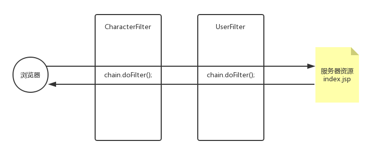

> ### 过滤器

1. 过滤器是 `MVC` 框架必备配置, 重要
   1. `MVC`框架有: `Struts2` + `SpringMVC` `!`
2. 首先我们看看过滤器是这么实现的, 底层原理就是 `责任链设计模式`
   1. 若成功理解了责任链设计模式, 在以后学习 MVC 框架是帮助非常大

> 我们来想一想过滤器的特点

1. 在配置过滤器时默认 `web.xml` 中配置的顺序, 决定了过滤器执行的顺序
   1. 问: 我记得在 `web.xml` 中可以修改 `filter` 默认的执行顺序的
2. 过滤器中的这个方法`chain.doFilter(request, response);`取决于是否执行后续 `filter`
3. 在过滤器中的`doFilter`中会发现这个方法会被`doFilter`这个方法切成两块
   1. 以上: `2` + `3` 在 `MVC` 框架的拦截器有相同的思想

> 图{过滤器执行顺序}



> 使用过滤器过滤用户权限

>  主线编程思路: 
>
>  	1. 首先我们要获取到用户
>  	 	1. 该用户在用户登录后存在服务器: Session 中
>  	2. 拿到当前登录的用户判断是否有权限
>  	3. 若没有权限可以有以下操作:
>  	 	1. 转发 OR 重定向: 没有权限的页面
>  	 	2. 抛出一个异常

> 主干代码实现

```java
HttpSession session = request.getSession();
User user = (User) session.getAttribute(User.LOGIN);
if (user == null || !"admin".equals(user.getRole())) {
    throw new RuntimeException("用户没有操作权限!");
}
chain.doFilter(request, response);
```

